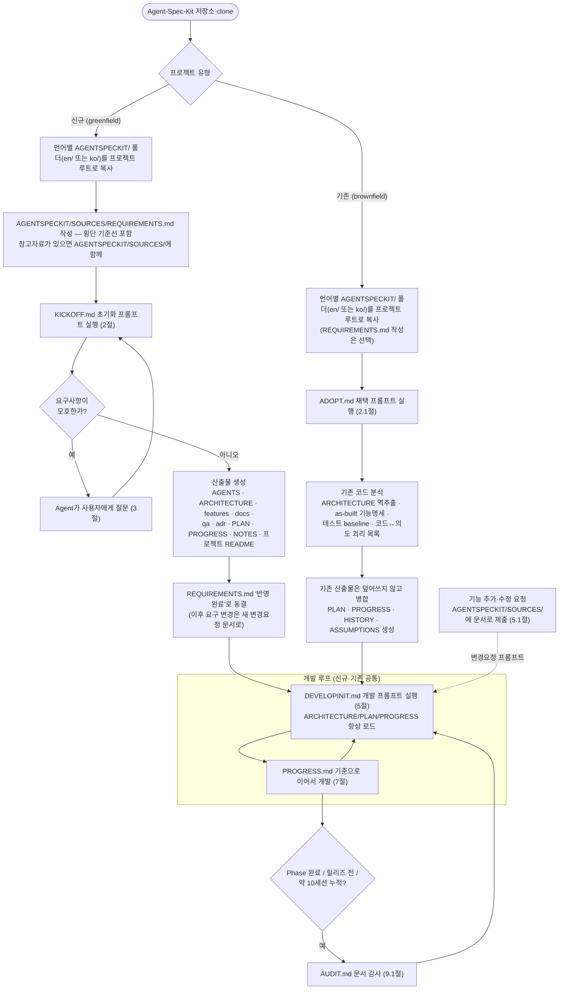

<div align="center">

# Agent-Spec-Kit

🌐 [English](README.md) · **한국어**

**AI 코딩 에이전트는 세션이 끝나면 모든 걸 잊습니다.**

Agent-Spec-Kit은 끊기지 않는 기억과, 코드 한 줄을 쓰기 *전에* 모든 명세를 토론·합의하는 전문가 페르소나 그룹을 더해 줍니다.
요구사항은 명세와 계획으로 컴파일되고, 결정·사실·토의가 **마크다운 + git** 파일 시스템에 쌓여 다음 세션이 끊긴 지점을 정확히 이어받습니다. 종속성 없음 — 같은 키트가 **Claude Code·Codex·Cursor**에서 그대로 동작합니다.

[빠른 시작](#빠른-시작) •
[왜 이 구조인가?](#왜-이-구조인가--llm의-한계와-이-프레임워크의-이점) •
[파일 구성](#1-기본-파일-구성) •
[시작하기](#2-최초-1회-프로젝트-초기화-프롬프트) •
[개발 진행](#5-실제-개발-시작-프롬프트) •
[사용 흐름](#10-사용-흐름-요약) •
[업데이트 히스토리](#12-업데이트-히스토리)

Codex · Claude Code · Cursor Agent

</div>

---

## 두 가지 버전: Solo와 Team

Agent-Spec-Kit은 두 가지 프레임워크로 제공됩니다. **이 문서(README)는 Solo 버전 사용 설명서**이며, 여러 명이 동시에 개발하는 팀은 **ASK-Team**을 사용하세요.

| | **Solo (ASK)** — 이 문서 | **Team (ASK-Team)** |
|---|---|---|
| 대상 | 1인 / 순차·자율 개발 | 다수 개발자·AI 에이전트 **동시** 개발 |
| 진행 상태 | 단일 `PROGRESS.md` 커서 | `workitems/` + `sessions/<handle>--<WI>` |
| 이력 / 가정 / 노트 | 단일 파일 | `history/` · `assumptions/` · `notes/` 디렉토리 |
| 인덱스 | 손으로 갱신 | 생성물 (`askctl index`, git 미추적) |
| 충돌 | 해당 없음 | `touches` + `askctl detect` + `conflicts/` |
| 식별 | 불필요 | `team/` + git identity + `askctl whoami` |
| 키트 폴더 | `ko/AGENTSPECKIT/` · `en/AGENTSPECKIT/` | `ko/ASK-TEAM/` · `en/ASK-TEAM/` |

- **Solo 가이드:** 이 문서를 계속 읽으세요. ([English](README.md))
- **Team 가이드:** [ko/ASK-TEAM/README.md](ko/ASK-TEAM/README.md) · [en/ASK-TEAM/README.md](en/ASK-TEAM/README.md)
- 1인 개발이면 Solo가 더 가볍습니다 — 실제로 N명이 동시에 개발할 때만 Team을 쓰세요.

> 저장소의 [OUTLINE.md](OUTLINE.md)는 이 프레임워크에 관한 **연구 논문 초안**(저자용)이며, 키트 사용에는 필요 없습니다.

---

이 문서는 `AGENTSPECKIT/` 폴더(프롬프트 4종 `KICKOFF.md`·`ADOPT.md`·`DEVELOPINIT.md`·`AUDIT.md` + 입력 채널 `SOURCES/`)를 Codex · Claude Code · Cursor Agent 등에서 사용하는 방법을 설명하는 **프레임워크 사용 설명서**입니다.

## 빠른 시작

1. 이 저장소를 `git clone` 합니다.
2. 여러분 **언어의 `AGENTSPECKIT/` 폴더** — `ko/AGENTSPECKIT/`(한국어) 또는 `en/AGENTSPECKIT/`(영어) — 를 프로젝트 루트로 복사합니다. (이 가이드 `README.md`는 복사하지 않습니다.)
3. **신규 프로젝트**면 `AGENTSPECKIT/SOURCES/REQUIREMENTS.md`에 요구사항을 작성합니다. **이미 코드가 있는 프로젝트**면 이 단계를 건너뜁니다.
4. 프로젝트 폴더에서 Agent(Claude Code · Codex · Cursor 등)를 열고, **[2절의 초기화 프롬프트](#2-최초-1회-프로젝트-초기화-프롬프트)**(기존 프로젝트는 **[2.1절의 채택 프롬프트](#21-이미-개발-중인-프로젝트에-적용할-때-채택-프롬프트)**)를 붙여넣습니다.
5. 초기화가 끝나면 **[5절의 개발 프롬프트](#5-실제-개발-시작-프롬프트)**로 실제 개발을 시작합니다.

> **모든 산출물은 `AGENTSPECKIT/` 안에 생성되어** 기존 프로젝트의 폴더(docs/ 등)와 충돌하지 않습니다. 프로젝트 루트에는 `AGENTS.md`·`CLAUDE.md`(도구 자동 인식 관례 — 이동 시 자동 로드가 깨짐)와 프로젝트 `README.md`만 생성/병합됩니다 — 이들은 Agent가 만드는 **산출물**이며, 이 가이드 `README.md`와는 다른 문서입니다.
>
> **`REQUIREMENTS.md`에는 반드시 프로젝트 개요·러프한 요구사항·핵심 기능·제약을 작성하세요.** Agent는 이를 기준으로 기능명세·횡단 계약·개발 계획을 생성하며, 목적·대상 사용자·MVP·데이터·외부 연동·인증/권한·QA 기준 등이 모호하면 임의로 추측하지 않고 질문합니다(3절).

---

## 왜 이 구조인가 — LLM의 한계와 이 프레임워크의 이점

이 프레임워크는 Karpathy의 LLM wiki 제안을 개발 워크플로에 번안한 것으로,
**LLM(Agent)의 본질적 한계 4가지를 마크다운 파일 시스템으로 우회**하는 설계입니다.
사용 전에 "무엇이 해결되고, 무엇은 해결되지 않는지"를 알고 시작하세요.

### 극복되는 한계

| LLM의 한계 | 이 프레임워크의 극복 메커니즘 |
|---|---|
| **세션이 끝나면 기억이 사라짐** | `PROGRESS.md`("다음 세션 첫 명령"), `HISTORY.md`, `NOTES.md`가 외부 기억 역할 → 다음 세션이 끊긴 지점을 정확히 이어받음 |
| **컨텍스트 창이 유한함** — 모든 문서를 매번 읽을 수 없음 | 항상 로드 4개(AGENTS/ARCHITECTURE/PLAN/PROGRESS) + 인덱스(features·docs·adr·SOURCES의 INDEX)로 **필요한 문서만 싸게 골라 읽는 선택적 로딩** |
| **매번 재유도(re-derive)함** — 같은 분석·같은 디버깅을 세션마다 반복 | 한 번 알아낸 사실은 `NOTES.md`에, 한 번 내린 결정은 ADR에, 한 번 합의한 명세는 `features/`에 "컴파일"되어 다시 계산하지 않음 |
| **그럴듯하게 지어냄 + 조용한 표류** — 구현 실수를 명세처럼 둔갑, 문서와 코드가 서서히 어긋남 | 권위 진단 규칙(코드↔명세 불일치 시 진단 먼저), 원자적 commit(코드와 문서가 항상 같은 상태), `AUDIT.md`(주기적 표류 회수) |

### 이점

1. **지식이 복리로 쌓입니다.** 보통 LLM 작업은 세션이 늘수록 맥락이 흩어지지만, 이 구조에서는 산출물·노트·결정이 누적되어 뒤로 갈수록 작업이 싸집니다.
2. **추적 가능성.** `AGENTSPECKIT/SOURCES/`의 불변 원본 → 산출물의 출처 링크 → `HISTORY.md`의 고정 접두사 이력으로, "왜 이렇게 됐나"를 언제든 거슬러 올라갈 수 있습니다.
3. **일관성.** 횡단 계약(`ARCHITECTURE.md`)을 매 세션 강제 로드하므로, 기능 10개를 10세션에 나눠 만들어도 네이밍·에러 포맷·인증 모델이 흔들리지 않습니다.
4. **중단 내성.** 어느 세션이 어디서 끊겨도(초기화 중이든 개발 중이든) PROGRESS 잠정 기록 덕분에 정확한 지점에서 재개됩니다.
5. **도구 독립성.** 전부 마크다운 + git이므로 Claude Code, Codex, Cursor 어느 Agent로 갈아타도 기억이 유지됩니다.

### 솔직한 잔존 한계 (이건 해결하지 못합니다)

- **Agent가 규칙을 따른다는 보장 자체는 없습니다.** 프롬프트는 강제가 아니라 지시이며, `AUDIT.md`는 위반을 사후에 잡을 뿐 예방하지 못합니다.
- **문서 유지 비용이 있습니다.** 매 작업마다 PROGRESS/HISTORY/인덱스를 갱신하는 비용은, 소규모 일회성 작업에서는 배보다 배꼽이 클 수 있습니다.
- 따라서 이 프레임워크는 **여러 세션에 걸친 중규모 이상 프로젝트**에서 이득이 비용을 넘어서는 설계입니다. 한두 세션짜리 단발 작업이라면 도입하지 않는 것이 합리적입니다.

> 도입을 가늠할 때 필요한 **세션당 토큰 사용량 기준치**는 문서 끝 [부록: 컨텍스트 비용](#부록-컨텍스트-비용-토큰-사용량-기준치)에 정리해 두었습니다.

---

## 1. 기본 파일 구성

이 저장소(Agent-Spec-Kit)는 아래 파일로 구성됩니다.

```text
/  (Agent-Spec-Kit 저장소 = 템플릿)
├── README.md               # 이 가이드의 영문판. 프로젝트로 복사하지 않음
├── README.ko.md            # 이 가이드(프레임워크 사용법). 프로젝트로 복사하지 않음
├── en/
│   └── AGENTSPECKIT/       # 영어 키트 — 구조 동일, 영어 내용
│       └── … (ko/AGENTSPECKIT/ 와 동일 구성)
└── ko/
    └── AGENTSPECKIT/       # ★ 한국어 키트. 이 폴더를 프로젝트 루트로 복사.
        ├── KICKOFF.md          # 신규(greenfield) 초기화용 프롬프트
        ├── ADOPT.md            # 기존(brownfield) 프로젝트 채택용 프롬프트
        ├── DEVELOPINIT.md      # 개발 진행용 프롬프트
        ├── AUDIT.md            # 주기적 문서 감사(표류 점검)용 프롬프트
        └── SOURCES/
            ├── INDEX.md        # 제출 자료 인덱스 (REQUIREMENTS.md 사전 등재)
            └── REQUIREMENTS.md # 사용자가 작성하는 초기 요구사항 (구 AGENTINIT.md)
```

각 언어 폴더는 자기완결적입니다: 내부 파일이 모두 정식 이름(`KICKOFF.md`, `ADOPT.md`, …)으로 되어 있어, 여러분 언어의 `AGENTSPECKIT/` 폴더를 프로젝트 루트로 복사하면 어떤 언어를 골랐든 모든 프롬프트와 경로 참조가 그대로 동작합니다. 복사하는 언어 폴더는 항상 **하나**뿐입니다.

프로젝트를 시작할 때는 이 저장소를 clone한 뒤, **여러분 언어의 `AGENTSPECKIT/` 폴더 — `ko/AGENTSPECKIT/` 또는 `en/AGENTSPECKIT/` — 를 프로젝트 루트로 복사**하세요. 이 가이드(`README.md`/`README.ko.md`)는 복사하지 않습니다.

- **신규 프로젝트(greenfield):** 복사 후 `AGENTSPECKIT/SOURCES/REQUIREMENTS.md`에 프로젝트 요구사항을 작성
- **이미 개발 중인 프로젝트(brownfield):** 동일하게 폴더 복사 (REQUIREMENTS.md 작성은 앞으로의 목표를 적고 싶을 때 선택)

폴더명이 `AGENTSPECKIT`이라 기존 프로젝트의 어떤 폴더와도 충돌하지 않으며,
이후 Agent가 생성하는 모든 산출물(명세·계획·QA·ADR 등)도 이 폴더 안에 만들어집니다.
외부 API 스펙·정책 문서 같은 참고자료가 있으면 `AGENTSPECKIT/SOURCES/`에 함께 넣으세요 — 초기화 때 같이 읽습니다.

가능한 범위에서 아래 내용을 작성하세요.

- 프로젝트 목적
- 대상 사용자
- 핵심 기능 (입도 가이드: 한 기능 = 한 사용자 가치, MVP 3~7개 권장)
- MVP에 반드시 포함할 기능
- 후순위 기능
- 외부 API / 외부 시스템
- 저장하거나 분석해야 할 데이터
- 화면 / UX 요구사항
- 인증 / 권한 요구사항
- **횡단(아키텍처) 기준선** (데이터 모델 공통 규칙, 네이밍, API 계약 스타일, 인증 모델)
- 테스트 / QA 요구사항
- 운영 / 배포 제약사항

각 파일의 역할은 다음과 같습니다.

| 파일 | 역할 |
|---|---|
| `README.md` | 프레임워크 사용 설명서(이 문서). 사람이 읽는 참조용이며 프로젝트로 복사하지 않음 |
| `AGENTSPECKIT/SOURCES/REQUIREMENTS.md` | 사용자가 작성하는 초기 요구사항 입력 문서 (brownfield에서는 선택). 초기화 후 `반영 완료`로 동결 |
| `AGENTSPECKIT/SOURCES/INDEX.md` | 제출 자료 인덱스. REQUIREMENTS.md가 유형 `초기 요구사항`으로 사전 등재되어 있음 |
| `AGENTSPECKIT/KICKOFF.md` | 신규 프로젝트 초기화용 프롬프트 (greenfield) |
| `AGENTSPECKIT/ADOPT.md` | 이미 개발 중인 프로젝트 채택용 프롬프트 (brownfield). 코드에서 역방향으로 문서 생성 |
| `AGENTSPECKIT/DEVELOPINIT.md` | 초기화/채택 이후 실제 개발 진행용 프롬프트 |
| `AGENTSPECKIT/AUDIT.md` | 주기적 문서 감사 프롬프트. Phase 완료/릴리즈 전/장기 누적 시 문서-코드 표류 점검 |

---

## 2. 최초 1회: 프로젝트 초기화 프롬프트

`AGENTSPECKIT/SOURCES/REQUIREMENTS.md` 작성을 완료한 뒤, Agent에 아래 프롬프트를 입력합니다.

```text
AGENTSPECKIT/SOURCES/REQUIREMENTS.md와 AGENTSPECKIT/KICKOFF.md를 읽고, KICKOFF.md의 지시에 따라 프로젝트 초기 설정을 진행하세요.

REQUIREMENTS.md는 사용자가 작성한 초기 요구사항이고, KICKOFF.md는 초기화 작업 지시서입니다.
산출물은 AGENTS.md, CLAUDE.md, 프로젝트 README.md(루트 3파일)를 제외하고 모두 AGENTSPECKIT/ 아래에 생성하세요.

반드시 다음을 수행하세요.

1. AGENTSPECKIT/SOURCES/REQUIREMENTS.md를 분석하고 INDEX 상태를 '검토 중'으로 갱신하세요.
   AGENTSPECKIT/SOURCES/에 다른 제출 자료(참고자료 등)가 있으면 함께 읽고 INDEX에 등록하세요.
2. 프로젝트 초기화에 필요한 핵심 요구사항이 충분한지 확인하세요.
3. 프로젝트 목적, 대상 사용자, MVP 기능, 사용자 시나리오, 데이터, 외부 연동, 인증/권한, QA 기준이 모호하면 초기화를 진행하기 전에 사용자에게 질문하세요.
4. 질문이 필요한 경우 한 번에 최대 5개 이내로 핵심 질문만 작성하세요.
5. 여러 기능에 공통 적용되는 계약(데이터 모델/네이밍/API/인증)을 정리하여 AGENTSPECKIT/ARCHITECTURE.md를 생성하세요.
6. KICKOFF.md의 절차에 따라 프로젝트 구조와 문서를 생성하세요.
7. AGENTSPECKIT/ 아래에 features/, docs/, qa/, personas/, adr/ 문서를 생성하세요. adr/INDEX.md를 포함하고,
   features/README.md와 docs/README.md는 KICKOFF.md 6.2·7.2절의 인덱스(목차) 형식으로 작성하세요.
8. AGENTSPECKIT/ 아래에 ARCHITECTURE.md, PLAN.md, PROGRESS.md, HISTORY.md, ASSUMPTIONS.md, NOTES.md를 생성하고,
   AGENTS.md와 CLAUDE.md는 프로젝트 루트에 생성하세요 (자동 인식 관례 — 안의 경로는 AGENTSPECKIT/ 접두로 명시).
8-1. 프로젝트 README.md(소개·설치·실행·구조·문서 링크)를 루트에 생성하세요. 민감 정보는 넣지 마세요.
9. feature 문서는 Multi-Agent 검토 결과를 바탕으로 작성하되, Agent별 발언록이 아니라 최종 합의된 기능명세서로 작성하고, 참여 Agent와 핵심 쟁점·결론을 3~4줄로 요약하고 검토 로그를 링크하세요.
10. QA는 feature별 테스트 시나리오와 qa/ 폴더의 회귀/수동/릴리즈 체크리스트로 분리하여 작성하세요. "테스트 통과"는 실제 실행 시에만 인정한다는 기준을 포함하세요.
11. 초기화를 마치기 전에 AGENTSPECKIT/SOURCES/INDEX.md에서 REQUIREMENTS.md의 상태를 '반영 완료'로 바꾸고
    반영 산출물 링크를 기록하세요. 이후 REQUIREMENTS.md 원본은 불변이며,
    추가 요구사항은 새 변경요청 문서로 받습니다.
12. 초기화가 끝나면 생성한 파일 목록, ARCHITECTURE 요약, 기능명세서 목록, QA 문서 목록, ADR 목록, 개발 Phase 요약, 다음 개발 시작 명령을 보고하세요.
```

이 프롬프트는 **프로젝트 초기 세팅 전용**입니다.
이 단계에서는 실제 구현을 시작하지 않고, 개발을 시작하기 위한 문서와 계획을 생성합니다.

> 초기화는 단계가 길어 중간에 끊길 수 있습니다. Agent는 각 단계가 끝날 때마다 `PROGRESS.md`의 초기화 진행 상태를 갱신하므로, 끊기면 같은 프롬프트로 이어서 진행하면 됩니다.

### 2.1 이미 개발 중인 프로젝트에 적용할 때 (채택 프롬프트)

신규가 아니라 **이미 코드가 있는 프로젝트**라면, `KICKOFF.md` 대신 `ADOPT.md`를 사용합니다.
`ADOPT.md`는 요구사항이 아니라 **기존 코드를 분석해 현재 상태를 역방향으로 문서화**하며,
산출물 구조는 `KICKOFF.md`와 동일하므로 채택이 끝나면 `DEVELOPINIT.md`로 그대로 개발을 이어갑니다.

```text
AGENTSPECKIT/ADOPT.md를 읽고, 그 지시에 따라 이미 개발 중인 이 프로젝트에 프레임워크를 채택(적용)하세요.

산출물은 AGENTS.md, CLAUDE.md, 프로젝트 README.md(루트 3파일)를 제외하고 모두 AGENTSPECKIT/ 아래에 생성하세요.
기존 프로젝트의 docs/ 등 동명 폴더는 건드리지 마세요.

반드시 다음을 지키세요.

1. 이 단계에서는 코드를 수정하지 않습니다. 현재 상태를 문서화하고 개발 계획을 세우는 단계입니다.
2. 먼저 AGENTSPECKIT/에 기존 산출물이 있는지 확인하세요 (있으면 이미 채택된 프로젝트 — 재채택하지 말고 보고).
   다음으로 루트의 README/AGENTS/CLAUDE/.gitignore가 있는지 인벤토리하세요.
   이미 있는 파일은 덮어쓰지 말고 병합하거나, 덮어써야 하면 확인을 받으세요.
3. 먼저 코드베이스를 스캔해 스택·빌드/실행/테스트 명령·구조·진입점·의존성·환경변수 이름을 파악하세요.
   (환경변수 값/Secret은 수집·기록하지 마세요.)
4. 그다음 진입점부터 주요 기능의 실제 구현·핵심 경로를 직접 읽고 동작을 추적하세요.
   파일명·구조만 보고 동작을 추측하지 말고, 메타데이터 스캔에서 멈추지 마세요.
   읽은 범위와 읽지 못한 범위를 명시하고, 미열람 영역은 AGENTSPECKIT/PROGRESS.md에 남기세요.
5. 읽은 코드에서 실제 컨벤션(네이밍/API 계약/에러 포맷/인증/데이터 모델)을 역추출해 AGENTSPECKIT/ARCHITECTURE.md를 만드세요.
   코드에서 확정할 수 없는 항목은 지어내지 말고 AGENTSPECKIT/ASSUMPTIONS.md(active, 검증 필요)에 남기세요.
6. 구현된 기능을 as-built 명세로 AGENTSPECKIT/features/*.md에 작성하세요.
   각 동작 주장은 근거 코드 위치(파일/함수)를 댈 수 있어야 하고, 직접 읽지 않은 동작은 단정하지 말고 "추정(검증 필요)"으로 표시하세요.
   코드와 의도가 어긋나는 지점은 따로 표시하세요.
7. 기존 테스트를 실제 실행해 baseline(통과/실패/부재)을 AGENTSPECKIT/HISTORY.md에 기록하세요.
8. AGENTSPECKIT/PLAN.md는 완료/진행 중/남은 것으로 현재 상태를 반영하고, AGENTSPECKIT/PROGRESS.md에 다음 세션 첫 명령을 적으세요.
9. AGENTSPECKIT/SOURCES/REQUIREMENTS.md가 있으면 앞으로의 목표·미구현 요구사항으로 사용하고, as-built와 충돌하면 질문하세요.
   채택이 끝나면 AGENTSPECKIT/SOURCES/INDEX.md에 유형 '초기 요구사항'으로 등록하고 '반영 완료'로 동결하세요.
10. 채택이 끝나면 ADOPT.md 7절 형식으로 결과를 보고하세요(읽은 범위, 코드↔의도 괴리 목록, 테스트 baseline 포함).
```

> 채택도 단계가 길어 끊길 수 있습니다. 각 단계 후 `PROGRESS.md`를 갱신하므로, 끊기면 같은 프롬프트로 이어서 진행하면 됩니다.

### 2.2 키트 업그레이드 (이미 적용된 프로젝트에 새 버전 반영)

이미 AGENTSPECKIT을 적용한 프로젝트에 템플릿의 갱신 내용을 반영할 때 사용합니다.
**KICKOFF/ADOPT를 재실행하지 마세요** — 재초기화·재채택 가드가 차단하며, 우회하면 산출물이 덮입니다.

처리 원리:

| 분류 | 대상 | 처리 |
|---|---|---|
| 키트 소유 (프로젝트 내용 없음) | `AGENTSPECKIT/`의 프롬프트 4종 | 새 버전으로 **덮어쓰기 복사** |
| 생성 산출물 (프로젝트 내용 있음) | features/, PLAN, PROGRESS, HISTORY, ASSUMPTIONS, SOURCES 원본 | **내용 보존** — 건드리지 않음 |
| 규칙 파일 (구버전 규칙으로 생성됨) | 루트 `AGENTS.md`, `CLAUDE.md` | **병합 갱신** — 누락 블록만 추가 |
| 신규 구조 (구버전에 없음) | TODO.md, NOTES.md, personas/, discussion/ 등 | **신규 생성/보강** |

**1단계 (사람):** 템플릿 저장소를 pull 받아, **처음 사용한 것과 같은 언어 폴더**(`en/AGENTSPECKIT/` 또는 `ko/AGENTSPECKIT/`)의 프롬프트 4종(KICKOFF/ADOPT/DEVELOPINIT/AUDIT)을
프로젝트의 `AGENTSPECKIT/`에 덮어쓰기 복사합니다.
(구버전이 루트 평면 구조라면 먼저 루트 3파일을 제외한 산출물을 `git mv`로 `AGENTSPECKIT/` 아래로 옮기는 커밋을 만듭니다.)

**2단계 (Agent):** 아래 프롬프트를 실행합니다.

```text
Agent-Spec-Kit 템플릿이 갱신되어 프롬프트 4종을 새 버전으로 교체했습니다.
이 프로젝트의 산출물 구조를 새 버전 기준으로 업그레이드하세요.
KICKOFF나 ADOPT를 재실행하지 마세요 (재초기화·재채택 금지). 기존 산출물의 내용은 보존합니다.

1. 새 AGENTSPECKIT/KICKOFF.md 1절의 구조와 현재 AGENTSPECKIT/를 대조해 누락된 파일·폴더를 식별하세요.
2. 누락분을 생성하세요.
   - NOTES.md / TODO.md: 빈 골격 (KICKOFF.md 15.1·15.3 형식)
   - SOURCES/INDEX.md: 없으면 생성하고, 있으면 유형/상태 컬럼을 15.2 형식으로 보강하세요.
     기존 요구사항 문서가 있으면 유형 '초기 요구사항', 상태 '반영 완료'로 등재하세요.
   - personas/: KICKOFF.md 5.2에 따라 이 프로젝트에 필요한 페르소나 인스턴스와 INDEX를 생성하세요
     (ARCHITECTURE.md를 읽고 프로젝트 특화 체크리스트 포함, 지식 복사 금지·링크만).
   - discussion/: 폴더만 생성 (이후 검토부터 적용).
3. 루트 AGENTS.md를 새 KICKOFF.md 9·10절 기준으로 병합 갱신하세요.
   기존 프로젝트 고유 내용은 보존하고, 누락된 원칙 블록(경로 접두/NOTES/SOURCES/TODO/검토 로그/언어·기록 범위)만 추가하세요.
   병합 결과의 서술 산문은 언어 기준(REQUIREMENTS.md의 주 언어)을 따르세요 —
   기존 내용이 다른 언어면 의미를 보존해 번역 병합하고, 언어가 섞인 채 이어 붙이지 마세요.
   충돌하면 덮어쓰지 말고 diff를 제시하고 확인을 받으세요.
3-1. 루트 CLAUDE.md는 병합이 아니라 새 KICKOFF.md 11절 템플릿(오작동 방지 전용)으로 **교체**하세요.
   단, 무손실 게이트를 지키세요: 제거되는 각 규칙이 AGENTS.md에 존재하는지 먼저 확인하고,
   없으면 AGENTS.md에 추가한 뒤 제거하세요. 프로젝트 고유 커스텀 규칙은 규정 언어로 번역해 보존하세요.
4. 기존 산출물(features/PLAN/PROGRESS/HISTORY/ASSUMPTIONS)의 내용은 수정하지 마세요.
   단 features/README.md 등 인덱스가 새 형식(6.2)과 다르면 내용을 보존한 채 형식만 맞추세요.
5. HISTORY.md에 `## [YYYY-MM-DD] chore | 프레임워크 업그레이드` 항목으로 기록하고,
   변경 전체를 하나의 commit으로 묶으세요.
6. 갱신/생성/보강한 파일 목록과 수동 확인이 필요한 충돌을 보고하세요.
```

**3단계 (검증):** 업그레이드 직후 문서 감사 프롬프트(9.1절)를 실행하면
인덱스 무결성·링크·누락 점검이 새 기준으로 수행되어 이행 누락을 잡아줍니다.

---

## 3. 초기화 단계에서 요구사항이 모호한 경우

초기화 단계에서는 요구사항 품질이 중요합니다.
다음 항목이 모호하면 Agent가 임의로 추측하지 않고 사용자에게 질문해야 합니다.

- 프로젝트 목적 / 대상 사용자 / MVP 핵심 기능 / 핵심 사용자 시나리오
- 외부 API / 외부 시스템 연동 목적
- 저장하거나 분석해야 할 데이터
- 민감정보 / 개인정보 / 보안 요구사항
- 인증 / 권한 / 관리자 기능
- 데이터 모델·인증 모델의 큰 방향 (ARCHITECTURE 기준선)
- 테스트 / QA 기준
- 배포 환경 / 운영 제약
- MVP와 후순위 기능 구분

반대로 파일명, 폴더 구조, 코드 스타일, 일반 테스트 도구, 로컬 개발 환경 구성, **네이밍 세부 표기 규칙** 같은 세부 기본값은 사용자에게 묻지 않고 `ASSUMPTIONS.md`(또는 `ARCHITECTURE.md`)에 기록한 뒤 진행합니다.

질문 예시:

```text
프로젝트 초기화를 위해 확인이 필요합니다.

AGENTSPECKIT/SOURCES/REQUIREMENTS.md를 분석한 결과, 초기 기능명세서와 개발 계획을 만들기 전에 아래 내용을 확인해야 합니다.

1. 이 프로젝트의 MVP에서 반드시 포함해야 하는 기능 3가지는 무엇인가요?
2. 주요 사용자는 일반 사용자, 관리자, 운영자 중 누구인가요?
3. 외부 API 연동 시 인증 방식과 호출 주기는 어떻게 되나요?

답변을 주시면 그 내용을 반영하여 초기화를 계속 진행하겠습니다.
```

### 3.1 모르는 항목은 AI에게 위임 (`[AI 위임]`)

답을 잘 모르거나 결정하기 어려운 항목은 비워두는 대신 `[AI 위임]`(별칭 `[AI에게 맡김]`, `[모름]`)을 적으면 됩니다. Agent는 위험도에 따라 다르게 처리합니다.

- **비핵심 항목**(네이밍, 코드 스타일, 비핵심 UI, 로그 포맷 등): 합리적 기본값으로 진행하고 `ASSUMPTIONS.md`에 기록합니다. 질문하지 않습니다.
- **핵심 항목**(MVP 범위, 데이터 모델, 인증/권한, 개인정보, 외부 연동 등): 초기화를 멈추지 않고, **가장 보수적이고 되돌리기 쉬운 선택**을 잠정 채택한 뒤 `ASSUMPTIONS.md`에 기록하고, 초기화 보고서의 **"AI 위임으로 결정한 항목 (검토 권장)"** 에 모아 표시합니다. 사용자는 나중에 확인·수정할 수 있습니다.

다만 두 가지는 위임할 수 없습니다. **프로젝트 목적과 핵심 기능을 둘 다 비우거나 위임하면**("이 프로젝트가 무엇인지" 자체가 없으면) Agent는 위임을 받지 않고 질문합니다. 또 **비용·결제·법적 영향·되돌리기 어려운 동작**이 걸린 항목은 위임돼도 조용히 결정하지 않고 보수적 기본값을 택한 뒤 확인을 요청합니다.

개발 단계에서도 동일합니다. 프롬프트에서 "이건 알아서 해줘"라고 위임하면 그 항목의 자율 판단 범위가 넓어지되, 핵심 항목은 보수적으로 결정하고 `ASSUMPTIONS.md`와 완료 보고에 남깁니다.

---

## 4. 초기화 완료 후 생성되는 문서

초기화가 완료되면 일반적으로 아래와 같은 구조가 생성됩니다.

```text
<프로젝트 루트>
├── README.md                # 프로젝트 README — 루트 고정 (산출물)
├── AGENTS.md                # Agent 작업 지시서 — 루트 고정 (도구 자동 인식 관례)
├── CLAUDE.md                # Claude Code 자동 로드 — 루트 고정
├── AGENTSPECKIT/            # ★ 프레임워크가 소유·관리하는 모든 것
│   ├── KICKOFF.md / ADOPT.md / DEVELOPINIT.md / AUDIT.md
│   ├── ARCHITECTURE.md
│   ├── PLAN.md
│   ├── PROGRESS.md
│   ├── HISTORY.md
│   ├── ASSUMPTIONS.md
│   ├── NOTES.md
│   ├── TODO.md
│   ├── SOURCES/
│   │   ├── INDEX.md
│   │   ├── REQUIREMENTS.md
│   │   └── *.md / *.pdf / *.txt / *.html
│   ├── features/
│   │   ├── README.md
│   │   └── *.md
│   ├── docs/
│   │   ├── README.md
│   │   └── *.md
│   ├── qa/
│   │   ├── README.md
│   │   ├── regression-checklist.md
│   │   ├── manual-test-cases.md
│   │   └── release-checklist.md
│   ├── personas/
│   │   ├── INDEX.md
│   │   └── *.md
│   ├── discussion/
│   │   └── review-*.md
│   └── adr/
│       ├── INDEX.md
│       └── *.md
└── (프로젝트 코드 — 기존 폴더는 건드리지 않음)
```

각 문서의 역할은 다음과 같습니다. (표의 경로는 루트 3파일을 제외하고 모두 `AGENTSPECKIT/` 기준)

| 파일 / 폴더 | 역할 |
|---|---|
| `README.md` | **프로젝트 README**(산출물). 프로젝트 소개·설치·실행·구조·문서 링크. push 단위로 갱신 |
| `AGENTS.md` | Agent가 매 실행마다 참조하는 작업 지시서 |
| `CLAUDE.md` | Claude Code 자동 로드 파일. AGENTS.md 참조 + **오작동 방지 규칙 전용 안전망** (워크플로 규칙은 AGENTS.md 단일 출처) |
| `ARCHITECTURE.md` | **횡단 계약**(데이터 모델/네이밍/API/인증). 모든 개발 세션에서 항상 로드 |
| `PLAN.md` | 전체 개발 Phase와 완료 조건 |
| `PROGRESS.md` | 현재 진행 상태와 다음 세션 첫 명령 |
| `HISTORY.md` | 작업 이력 (`## [날짜] type \| 제목` 고정 접두사, 길어지면 아카이브) |
| `ASSUMPTIONS.md` | Agent가 자율 판단한 내용 (상태/충돌 관리 포함) |
| `NOTES.md` | 개발 중 학습한 비자명한 **사실**의 주제별 축적 (추측은 ASSUMPTIONS로) |
| `TODO.md` | **백로그** — 착수 미결정 항목의 수집함 (카테고리/우선순위/상태/승격처 링크). 선택 로드, 진행 상태의 진실은 PLAN·features 인덱스 |
| `AGENTSPECKIT/SOURCES/INDEX.md` | 사용자 제출 자료 인덱스 (유형/제출일/상태/요약/반영 산출물) |
| `AGENTSPECKIT/SOURCES/*` | 사용자 제출 원본 — 참고자료·변경요청 (반영 완료 후 불변, 변경은 새 문서 추가) |
| `features/README.md` | 기능 인덱스 (상태/Phase/관련 ADR 테이블) |
| `features/*.md` | 기능별 최종 기능명세서 (검토 요약 포함) |
| `docs/README.md` | 사용자 문서 인덱스 |
| `docs/*.md` | 사용자 / 운영자용 문서 |
| `qa/*.md` | QA 운영, 회귀 테스트, 수동 QA, 릴리즈 체크리스트 |
| `personas/INDEX.md` | 페르소나 인스턴스 목록 (담당 관점/파일/생성일) |
| `personas/*.md` | 프로젝트 맥락이 주입된 검토 페르소나 정의 (체크리스트+링크만, 검토 시에만 로드) |
| `discussion/review-*.md` | Multi-Agent 검토의 토의 과정 기록 (불변, 평소 비로드 — 분쟁·감사 시에만 열람) |
| `adr/INDEX.md` | ADR 목록 인덱스 |
| `adr/*.md` | 중요한 설계 결정 기록 |

---

## 5. 실제 개발 시작 프롬프트

초기화가 끝난 뒤 실제 개발을 시작할 때는 아래 프롬프트를 입력합니다.

```text
AGENTS.md와 AGENTSPECKIT/DEVELOPINIT.md를 읽고, 현재 프로젝트 문서를 기준으로 실제 개발을 시작하세요.

프레임워크 문서는 루트의 AGENTS.md/CLAUDE.md/README.md를 제외하고 모두 AGENTSPECKIT/ 안에 있습니다.

반드시 다음 순서로 진행하세요.

1. AGENTS.md(루트)를 읽으세요.
2. AGENTSPECKIT/ARCHITECTURE.md를 읽으세요. (횡단 계약 — 항상 로드)
3. AGENTSPECKIT/PLAN.md를 읽으세요.
4. AGENTSPECKIT/PROGRESS.md를 읽고 "다음 세션 첫 명령"을 확인하세요.
5. 필요한 범위에서 AGENTSPECKIT/HISTORY.md로 중복 구현 여부를 확인하세요.
6. AGENTSPECKIT/features/README.md와 AGENTSPECKIT/adr/INDEX.md를 확인하세요.
7. 현재 Phase와 관련된 feature 문서와 관련 ADR만 선택적으로 읽으세요.
8. AGENTSPECKIT/qa/README.md를 읽고, 현재 작업에 필요한 QA 문서만 선택적으로 확인하세요.
9. AGENTSPECKIT/NOTES.md에 현재 작업 주제와 관련된 항목이 있으면 확인하세요.
10. DEVELOPINIT.md의 절차에 따라 현재 Phase를 구현하세요.

주의사항:

- AGENTSPECKIT/SOURCES/REQUIREMENTS.md(반영 완료)를 기준으로 프로젝트를 다시 초기화하지 마세요.
  새 요구사항은 AGENTSPECKIT/SOURCES/에 변경요청 문서로 제출받아 DEVELOPINIT.md 4.2로 처리하세요.
- AGENTSPECKIT/의 ARCHITECTURE.md, PLAN.md, PROGRESS.md는 항상 로드합니다. feature/QA 문서는 현재 Phase에 필요한 것만 읽으세요.
- 공통 결정(데이터 모델/네이밍/API/인증)은 ARCHITECTURE.md를 기준으로 따르세요.
- 명세 없이 추측으로 구현하지 마세요.
- 코드와 명세가 다르면 먼저 어느 쪽이 권위인지 진단한 뒤 처리하세요. 구현 실수를 명세로 둔갑시키지 마세요.
- 테스트는 실제로 실행하고 결과를 HISTORY.md에 기록하세요. 실행 없이 통과를 주장하지 마세요.
- 개발 중 학습한 비자명한 사실은 NOTES.md에 기록하세요. 추측은 ASSUMPTIONS.md에 기록하세요.
- AGENTSPECKIT/SOURCES/INDEX.md에 미반영/검토 중 변경요청이 있으면 보고하고, 우선 처리할지 확인하세요.
- 문서 상호참조는 상대경로 링크로 적고, feature/docs/ADR 변경 시 해당 인덱스를 같은 commit에서 갱신하세요.
- 작업 시작 시 PROGRESS.md의 진행 상태와 다음 세션 첫 명령을 잠정 기록하세요.
- 의미 있는 작업 단위가 끝나면 코드+문서를 하나의 commit으로 묶어 commit/push 하세요.
- main/master 직접 push는 금지입니다.
- 작업 완료 후 ARCHITECTURE.md(변경 시), PLAN.md, PROGRESS.md, HISTORY.md를 갱신하세요.
- push 시 사용자·설치·실행·아키텍처에 영향이 있으면 프로젝트 README.md를 같은 커밋에서 갱신하세요.
```

이 프롬프트는 **실제 개발 시작용**입니다.

### 5.1 개발 중 기능 추가 / 기능 수정 요청 (AGENTSPECKIT/SOURCES/ 사용법)

초기화 이후 새 기능 추가나 기존 기능·아키텍처 수정이 필요하면, 대화로만 설명하지 말고
요청 내용을 문서(md 권장, pdf/txt/html 가능)로 작성해 프로젝트의 `AGENTSPECKIT/SOURCES/` 폴더에 넣으세요.
원본이 보존되므로 나중에 "왜 이렇게 바뀌었나"를 추적할 수 있습니다.

**AGENTSPECKIT/SOURCES/ 폴더 규칙 요약** (상세: KICKOFF.md 15.2, 반영 절차: DEVELOPINIT.md 4.2):

- 문서 유형은 두 가지입니다. **참고자료**(사실의 기록: API 스펙, 정책 문서)와
  **변경요청**(의도의 기록: 기능 추가/수정, 아키텍처 변경).
- 제출된 원본은 **불변**입니다. 반영된 문서를 고치지 말고, 내용이 바뀌면 **새 문서를 추가**하세요.
  이전 문서는 `AGENTSPECKIT/SOURCES/INDEX.md`에서 `대체됨`으로 표시됩니다 (불변·추가 전용).
- 모든 문서는 `AGENTSPECKIT/SOURCES/INDEX.md`에 등재되어 상태(`미반영`/`검토 중`/`반영 완료`/`반려`/`대체됨`)로 관리됩니다.
- 변경요청은 **반영 완료 전까지 권위가 없습니다.** 요청은 한 번 검토·반영되면 다시 읽지 않으며,
  이후의 진실은 반영된 ARCHITECTURE/features/ADR이 이어받습니다.

**변경요청 문서 양식** (AGENTSPECKIT/SOURCES/REQUIREMENTS.md의 해당 절을 부분 재사용):

```md
# 변경요청: <제목>

## 1. 배경 / 목적

## 2. 추가·수정할 기능 (REQUIREMENTS.md 3절 입도 가이드 준수)

## 3. 영향 범위 추정 (아는 만큼만 — 모르면 [AI 위임])

## 4. 횡단 기준선 영향 여부 (데이터 모델/네이밍/API/인증 — 모르면 [AI 위임])

## 5. 우선순위 / 희망 일정
```

**기능 추가 / 기능 수정 지시 프롬프트:**

```text
AGENTSPECKIT/SOURCES/<파일명>을 변경요청으로 제출했습니다.

AGENTS.md와 AGENTSPECKIT/DEVELOPINIT.md를 읽고, DEVELOPINIT.md 4.2 절차에 따라 이 제출 자료를 처리하세요.

반드시 다음을 지키세요.

1. AGENTSPECKIT/SOURCES/INDEX.md에 등록하세요 (유형: 변경요청, 상태: 미반영 → 검토 중).
2. 문서를 읽고 요약과 영향 분석(ARCHITECTURE 충돌, 영향 feature, ADR 필요 여부)을 수행하세요.
3. MVP 범위·데이터 모델·인증/권한·횡단 계약 변경이 필요하면 반영 전에 사용자에게 확인하세요.
4. 기능 범위가 바뀌면 Multi-Agent 재검토를 수행하고, 횡단 계약 변경은 ADR을 작성하세요.
5. 반영 시 features/ARCHITECTURE/PLAN(필요 시 docs/qa) 문서를 갱신하고,
   각 산출물에 출처(AGENTSPECKIT/SOURCES/<파일명>)를 상대경로 링크로 남기세요.
6. 모든 항목이 문서에 반영됐을 때만 INDEX 상태를 '반영 완료'로 바꾸세요.
   부분 반영이면 '검토 중'으로 두고 남은 항목을 PROGRESS.md에 기록하세요.
7. 이 작업은 증분 반영입니다. 프로젝트를 재초기화하지 마세요.
8. 원본 문서는 수정하지 마세요. 이 요청이 이전 요청을 수정하는 것이면
   이전 문서를 INDEX에서 '대체됨'으로 표시하세요.
9. 반영이 끝나면 같은 세션에서 구현까지 이어갈지, 반영(문서)까지만 할지 확인하세요.
```

**참고자료 제출 프롬프트** (변경 작업 없이 등록·요약만):

```text
AGENTSPECKIT/SOURCES/<파일명>을 참고자료로 제출했습니다.

AGENTSPECKIT/DEVELOPINIT.md 4.2 절차에 따라 AGENTSPECKIT/SOURCES/INDEX.md에 등록하고(유형: 참고자료),
문서를 읽고 요약을 INDEX에 기록하세요.
이 단계에서는 기능 변경 작업을 하지 마세요.
관련 feature/ARCHITECTURE 문서에서 이 자료를 근거로 참조해야 할 곳이 있으면 링크만 추가하세요.
```

### 5.2 백로그(TODO.md) 사용법

개발 중 "나중에 하면 좋겠다" 수준의 아이디어는 변경요청 문서를 쓰는 대신 한 줄로 등록을 지시하세요.

```text
이 기능 TODO에 등록해줘: <한 줄 설명>
```

- Agent가 카테고리(기능/개선/버그/기술부채)로 분류해 `AGENTSPECKIT/TODO.md`에
  한 줄(내용·우선순위·상태 `대기`·등록일)로 등록하고 commit합니다.
- **등록은 착수가 아닙니다.** 구현하려면 "TODO의 <항목> 착수해줘"라고 지시하세요 —
  자명한 항목은 feature 문서로 직행하고, 횡단 영향이 있는 항목은 SOURCES/ 변경요청으로
  승격해 처리합니다 (AGENTSPECKIT/DEVELOPINIT.md 4.3). 승격 시 TODO에 승격처가 링크됩니다.
- TODO는 **백로그(수집함)이지 상태판이 아닙니다.** 진행 상태의 진실은 PLAN.md와
  features/README.md이며, 명세는 TODO가 아니라 features/에 작성됩니다.
- 하지 않기로 한 항목은 삭제하지 않고 `보류`/`폐기`(사유)로 남깁니다. 방치된 항목은 AUDIT이 점검합니다.

### 5.3 기능 추가 검토·설계 프롬프트 (검토 강도 선택)

새 기능의 설계 검토를 시작할 때, "OOO 기능 추가를 검토하고 설계하세요" 같은 한 줄 지시로도
Agent가 검토 체계로 라우팅해야 *하지만*, 프롬프트는 강제가 아니라서 검토를 건너뛸 수 있습니다.
아래처럼 검토 체계를 **명시 호출**하면 건너뛰기가 어려워집니다. 상황에 따라 3가지 강도 중 선택하세요.

| 상황 | 방식 |
|---|---|
| 가벼운 기능, 어느 Agent 도구든 | **방식 1** — 표준 검토(역할극) 명시 호출 |
| 중요·논쟁적 기능, 서브에이전트 지원 환경(Claude Code 등) | **방식 2** — 실제 서브에이전트 병렬 토론 |
| MVP 범위·횡단 계약을 건드릴 수 있는 공식 요구사항 | **방식 3** — SOURCES/ 변경요청(5.1절) + 방식 1 또는 2 결합 |

**방식 1 — 표준 검토 명시 호출** (비용: 1세션):

```text
OOO 기능 추가를 검토하고 설계하세요. 구현은 시작하지 마세요.

1. AGENTS.md와 AGENTSPECKIT/DEVELOPINIT.md 6절(Multi-Agent 검토)을 따르세요.
2. AGENTSPECKIT/personas/INDEX.md에서 이 기능과 관련된 페르소나 인스턴스를 골라 주입하고,
   필요한 관점이 없으면 KICKOFF.md 5.2 기준으로 새 인스턴스를 만드세요.
3. 토의 과정을 AGENTSPECKIT/discussion/review-<기능슬러그>-YYYYMMDD.md에 기록하세요.
   페르소나별 위험·근거를 남기고, Research Agent는 출처(URL/SOURCES 경로)를 반드시 명시하세요.
4. 합의안으로 feature 문서 초안(KICKOFF.md 6.1 템플릿)을 작성하세요.
   MVP 범위·데이터 모델·인증·횡단 계약에 영향이 있으면 반영 전에 확인을 요청하세요.
5. 검토 요약(참여 페르소나 / 핵심 쟁점 / 결론 3~4줄 + 로그 링크)과 설계안을 보고하세요.
```

**방식 2 — 실제 서브에이전트 병렬 토론** (판단 독립성 + Research의 실제 도구 사용, 비용: 토큰 N배):

```text
OOO 기능 추가를 검토하고 설계하세요. 구현은 시작하지 마세요.
페르소나 토의는 역할극이 아니라 실제 서브에이전트로 병렬 실행하세요.

1. AGENTSPECKIT/personas/INDEX.md에서 관련 페르소나 3~5개를 선택하세요.
2. 각 페르소나 인스턴스 파일을 역할 정의로 삼아 서브에이전트를 하나씩 띄우고,
   서로의 출력을 보지 않은 상태에서 각자 독립적으로 검토시키세요
   (각자: 발견한 위험 / 근거·출처 / 제안. Research 역할은 실제 조사를 수행하고 출처를 명시).
3. 결과를 취합해 쟁점과 충돌을 정리하고 합의안을 도출하세요.
   합리적으로 합의되지 않는 쟁점은 선택지와 권장안을 붙여 사용자에게 확인하세요.
4. 토의 전 과정을 AGENTSPECKIT/discussion/review-<기능슬러그>-YYYYMMDD.md에 기록하고
   (참여 페르소나 항목에 인스턴스 파일 링크), feature 문서 초안을 작성해 보고하세요.
```

> 방식 2가 가능한 이유: `personas/` 인스턴스 파일이 곧 서브에이전트의 역할 정의(시스템 프롬프트)이고,
> `discussion/` 로그 형식은 실행 방식(역할극/실제 병렬)과 무관하게 동일합니다 (9.2절 참조).

**방식 3 — 정식 변경요청과 결합**: 5.1절대로 변경요청 문서를 `AGENTSPECKIT/SOURCES/`에 제출한 뒤,
방식 1 또는 2의 프롬프트 첫 줄에 `이 검토는 SOURCES/<파일명> 변경요청의 반영 과정입니다.`를 추가하세요.
영향 분석→확인→검토→반영의 전 과정이 출처 추적과 함께 남습니다.

---

## 6. 개발 중 사용자에게 질문하는 기준

개발 단계에서 Agent는 사소한 구현 판단(내부 함수명·파일 위치·테스트/mock 데이터·비핵심 UI 배치·작은 리팩터링·QA 체크리스트 보완 등)마다 묻지 않고, 이미 생성된 `AGENTS.md`·`ARCHITECTURE.md`·`PLAN.md`·`PROGRESS.md`·`features/*.md`·`qa/*.md`를 기준으로 자율 진행합니다. 자율 판단은 `ASSUMPTIONS.md`에 기록합니다(기존 가정과 충돌 점검 포함).

질문은 **기존 기획의도와 완전히 다른 결정이 필요할 때만** 합니다 — MVP 범위, 데이터 모델·인증/권한·보안의 근본 변경, 핵심 UX 흐름, **ARCHITECTURE.md 횡단 계약**의 변경, 외부 연동 방식 교체, 그리고 비용·결제·법적 영향이나 되돌리기 어려운 파괴적 변경.

> 이 절은 **사용자가 무엇을 기대할지에 대한 요약**입니다. Agent가 따르는 판단 기준의 정본은 `DEVELOPINIT.md`·`AGENTS.md`에 있습니다.

---

## 7. 다음 날 또는 세션이 끊긴 뒤 이어서 작업하는 프롬프트

```text
AGENTS.md와 AGENTSPECKIT/DEVELOPINIT.md를 읽고, AGENTSPECKIT/PROGRESS.md의 "다음 세션 첫 명령"을 기준으로 이전 작업을 이어서 진행하세요.

AGENTSPECKIT/의 ARCHITECTURE.md와 PLAN.md를 함께 읽어 횡단 계약을 다시 맞추세요.
이미 완료된 작업은 다시 수행하지 마세요. AGENTSPECKIT/HISTORY.md(및 아카이브)를 확인하여 중복 구현을 방지하세요.
현재 Phase와 관련된 feature 문서와 관련 ADR만 읽고 개발을 계속하세요.
현재 작업에 필요한 QA 문서만 확인하세요.

작업 시작 시 PROGRESS.md의 진행 상태를 잠정 갱신하고,
작업이 끝나면 PLAN.md, PROGRESS.md, HISTORY.md, ASSUMPTIONS.md를 갱신하고 코드+문서를 묶어 commit/push 하세요.
```

---

## 8. QA 진행 방식

QA는 두 단계로 나뉩니다 — **기능별 테스트 시나리오**(`features/*.md`)와 **전체 회귀·수동 QA·릴리즈 체크리스트**(`qa/*.md`).

개발 중 Agent는 현재 feature의 테스트 시나리오를 확인해 자동 테스트를 작성·**실제 실행**하고, 실패를 수정한 뒤 회귀 영향과 수동 QA 필요 여부를 판단하며, 실행·QA 결과를 `HISTORY.md`·`PROGRESS.md`에 기록합니다.

> **"테스트 통과"는 테스트를 실제로 실행하고 결과를 기록했을 때만 인정합니다.** 배포·릴리즈 작업이 포함되면 `qa/release-checklist.md`를 확인합니다. (세부 절차의 정본은 `DEVELOPINIT.md`입니다.)

### 8.1 프로젝트 README.md 갱신 (push 단위)

프로젝트 `README.md`는 "이 프로젝트가 무엇이고 어떻게 설치·실행하는지"를 담는 산출물입니다(Agent-Spec-Kit 저장소의 가이드 `README.md`와는 별개의 다른 저장소 문서).

- **생성**: 초기화 시 KICKOFF가 `ARCHITECTURE.md` / `features/` / `PLAN.md`를 바탕으로 초안을 만듭니다.
- **갱신 시점**: 매 commit이 아니라 **push 단위에서 갱신 필요 여부를 점검**합니다. 다음이 바뀌었으면 같은 원자적 커밋에 README 변경을 포함합니다.
  - 프로젝트 소개 / 기능 목록 (새 feature 완료 등)
  - 설치 / 실행 / 빌드 방법, 의존성, 환경변수 **이름**(값/Secret은 절대 기재 금지)
  - 프로젝트 구조, 주요 문서 링크(docs/ 등)
  - `ARCHITECTURE.md`의 사용자 노출 사항(예: 지원 환경)
- **갱신 불필요**: 내부 리팩터링, 테스트 전용 변경, 비핵심 UI 미세 조정 등 사용자·설치·실행에 영향이 없으면 README를 건드리지 않습니다.
- README는 항상 로드하는 기준 문서가 아니라 **파생 산출물**입니다. 진실의 출처는 `ARCHITECTURE.md`/`features/`이며, README는 그것을 요약·링크합니다.

---

## 9. 일관성 유지 메커니즘 (이 버전의 핵심)

기능과 세션이 늘어나도 개발 방향이 흔들리지 않도록 다음을 사용합니다.

```text
ARCHITECTURE.md   → 모든 기능에 공통되는 계약을 한 곳에. 매 세션 항상 로드.
adr/INDEX.md      → 중요한 결정의 목록. 선택적 로딩 세션이 관련 결정을 싸게 발견.
features/README.md → 기능 인덱스(상태/Phase/ADR). 읽을 feature 문서를 싸게 선택.
PROGRESS(잠정 기록) → 세션이 끊겨도 다음 세션이 정확히 이어받음.
원자적 commit      → 코드와 문서가 항상 같은 상태로 남음.
권위 진단 규칙      → 코드-명세 불일치를 임의로 지우지 않음. 표류 방지.
HISTORY 회전       → 이력을 잃지 않으면서 컨텍스트 부담을 관리.
NOTES.md          → 학습한 사실의 복리 축적. 같은 사실을 재발견하지 않음.
AGENTSPECKIT/SOURCES/INDEX.md  → 제출 자료의 수명 추적(미반영→반영/반려/대체). 원본 불변·추가 전용,
                    변경요청은 한 번 반영되면 산출물이 진실을 이어받음.
AUDIT(주기 감사)   → 기록 시점 점검이 놓친 점진적 표류를 주기적으로 회수.
```

핵심 원칙: **공통 결정은 ARCHITECTURE.md에, 중요 결정은 ADR에, 진행 상태는 PROGRESS에, 이력은 HISTORY에, 학습한 사실은 NOTES에.** feature 문서에는 그 기능 고유의 명세만 둡니다.

### 9.1 주기적 문서 감사 (AUDIT.md)

기록 시점의 충돌 점검만으로는 세션이 쌓이며 생기는 표류(갱신 안 된 PLAN, 폐기됐어야 할 가정, 코드와 어긋난 명세, 인덱스 누락)를 잡을 수 없습니다.
**Phase 완료 직후 / 릴리즈 전 / 오랜만의 재개 / 약 10세션 누적** 시점에 아래 프롬프트를 실행하세요.

```text
AGENTSPECKIT/AUDIT.md를 읽고, 그 지시에 따라 프로젝트 문서와 코드의 표류를 감사하세요.
프레임워크 문서는 루트 3파일(README/AGENTS/CLAUDE)을 제외하고 모두 AGENTSPECKIT/ 안에 있습니다.

반드시 다음을 지키세요.

1. 이 단계에서는 기능 코드를 수정하지 않습니다. 점검·기록 단계입니다.
2. 인덱스 누락, 끊어진 링크 같은 기계적 불일치는 즉시 수정하고 감사 commit에 포함하세요.
3. 코드와 명세의 의미적 불일치는 수정하지 말고 발견 목록으로 정리하세요.
   처리는 DEVELOPINIT.md 3.4(권위 진단)를 따르는 별도 개발 작업으로 분리합니다.
4. ASSUMPTIONS.md의 active 가정 중 확정/폐기됐어야 할 것을 점검하세요.
5. 감사 결과를 HISTORY.md에 audit 항목으로 기록하고, 후속 작업을 PROGRESS.md에 반영하세요.
6. AUDIT.md 5절 형식으로 보고하세요.
```

### 9.2 Multi-Agent 검토 체계 (personas/ + discussion/)

기능명세 작성과 설계 변경 검토는 여러 페르소나가 토의하는 방식으로 진행되며,
"검토를 건너뛰고 그럴듯한 결론만 적는 것"을 막기 위해 다음 체계를 사용합니다.

```text
personas/*.md          페르소나 인스턴스 — 프로젝트 맥락이 주입된 관점 정의. 검토 시에만 로드.
      ↓ (검토 시 주입)
discussion/review-*.md 토의 과정 기록 — 페르소나별 위험·근거/출처·쟁점·결론. 불변·평소 비로드.
      ↓ (결론만 반영)
features/*.md          검토 요약 3~4줄(참여/핵심 쟁점/결론) + 로그 링크. 중요 결정은 adr/로 분리.
      ↓ (표본 검증)
AUDIT.md 3.10          출처가 실재하는가, 페르소나가 실재하는가, 연극성 로그는 아닌가.
```

**페르소나 (personas/)** — KICKOFF.md 5절:

- 초기화 때 카탈로그(PM/Research/Architect/DB/Backend/Frontend/Security/QA 등 10종)에서
  **프로젝트에 필요한 것만(보통 4~7개)** 골라, 프로젝트 특화 체크리스트를 가진 인스턴스 파일로 생성합니다.
- 인스턴스에는 관점·체크리스트·참조 링크만 담습니다. ARCHITECTURE/NOTES의 **지식을 복사하지 않습니다**(단일 출처 유지).
- 쟁점·조사·선택이 필요한 검토 시점에 INDEX에서 골라 해당 파일만 읽어 주입합니다. 새 관점이 필요하면 그때 추가합니다.

**토의 기록 (discussion/)** — KICKOFF.md 4.1:

- 비자명한 기능을 검토하면 토의 전 과정을 `discussion/review-<기능슬러그>-YYYYMMDD.md`에
  구조화 형식(참여 페르소나/페르소나별 검토/쟁점과 충돌/결론과 반영처)으로 기록합니다.
- **근거·출처 의무**: 특히 Research Agent는 출처(URL/SOURCES 경로/문서명)를 반드시 명시하고,
  못 대면 "조사 수행 못함"으로 기록합니다. 출처 없는 조사 결과는 단정할 수 없습니다.
- 로그는 **불변·추가 전용**이며(재검토 시 새 파일), 평소 세션에서는 로드하지 않아 **고정 토큰 비용이 없습니다.**
- 로그는 검토의 "증거"가 아니라 **수행을 강제하고 표본 검증을 가능하게 하는 장치**입니다.
  AUDIT가 표본을 열어 출처 실재 여부와 페르소나 실재 여부를 대조합니다.

자명한 기능(단순 CRUD·정적 화면)은 페르소나 토의·로그를 생략하고 "단순 기능 — 추가 검토 불필요"로 표기합니다.

---

## 10. 사용 흐름 요약

신규(greenfield)와 기존(brownfield)은 **초기화 경로만 다르고, 이후 개발 루프는 동일**합니다.



---

## 11. 프롬프트 선택 기준

| 상황 | 사용할 프롬프트 |
|---|---|
| 신규 프로젝트를 처음 시작할 때 | 초기화 프롬프트 (2절, KICKOFF.md) |
| 이미 개발 중인 프로젝트에 적용할 때 | 채택 프롬프트 (2.1절, ADOPT.md) |
| 기능명세서와 문서 생성 후 개발을 시작할 때 | 실제 개발 시작 프롬프트 (5절) |
| 이전 작업을 이어서 할 때 | 이어서 작업하는 프롬프트 (7절) |
| 개발 중 새 기능 추가·기존 기능 수정을 문서로 요청할 때 | 변경요청 처리 프롬프트 (5.1절, AGENTSPECKIT/SOURCES/) |
| 외부 스펙·정책 문서 등 참고자료를 등록할 때 | 참고자료 제출 프롬프트 (5.1절, AGENTSPECKIT/SOURCES/) |
| 아이디어를 가볍게 적어둘 때 / 백로그 관리·착수 | TODO 등록·승격 (5.2절, AGENTSPECKIT/TODO.md) |
| 새 기능의 설계 검토를 시작할 때 (검토 강도 선택) | 기능 추가 검토·설계 프롬프트 (5.3절 — 표준/서브에이전트/변경요청 결합) |
| 키트를 새 버전으로 업그레이드할 때 (이미 적용된 프로젝트) | 업그레이드 프롬프트 (2.2절) |
| Phase 완료 / 릴리즈 전 / 문서-코드 표류가 의심될 때 | 문서 감사 프롬프트 (9.1절, AUDIT.md) |

---

## 12. 업데이트 히스토리

키트(템플릿)의 변경 이력입니다. 각 프로젝트의 작업 이력(`AGENTSPECKIT/HISTORY.md`)과는 별개입니다.
**2.2절로 키트를 업그레이드할 때는, 프로젝트가 마지막으로 적용한 날짜 이후의 항목이 반영 대상입니다.**
`⚠ 구조 변경` 표시가 있는 항목은 기존 프로젝트에 이행 작업(파일 이동·병합 등)이 필요합니다.

> 유지 규칙: 템플릿에 의미 있는 변경을 commit할 때 같은 commit에서 이 절을 갱신합니다.
> 항목이 길어지면 오래된 연도를 `<details>` 접기로 압축합니다.

### [2026-06-13]

- **키트를 언어별 폴더 `en/AGENTSPECKIT/`·`ko/AGENTSPECKIT/`로 분리** — 각 폴더는 정식 이름 파일(`KICKOFF.md`, `ADOPT.md`, …)로 자기완결적이라, 자기 언어 폴더 하나만 복사하면 프로젝트에 타 언어 파일이 섞이지 않습니다. 동시에 한국어 프롬프트가 형제 파일을 정식 `.md` 이름으로 참조하는데 실제로는 `.ko.md`로 묶여 있던 잠재적 불일치도 해소했습니다. 작업용 프롬프트의 파일별 언어 스위처는 제거했습니다(이 가이드 README에만 유지). **이미 적용한 프로젝트는 마이그레이션 불필요** — 프로젝트의 `AGENTSPECKIT/` 내부 구조는 그대로이며, 이번 변경은 템플릿 저장소의 재배치일 뿐입니다.

### [2026-06-12]

- **산출물 언어 정책 신설** — 서술 산문은 `REQUIREMENTS.md`의 주 언어(또는 지정 언어)로 통일, 코드 식별자·API 경로·commit 메시지는 영어 유지, 절별 언어 전환 금지. 초기화 시 feature/docs의 영한 혼용 방지 (KICKOFF 머리말·9절, REQUIREMENTS "산출물 작성 언어" 항목, AUDIT 3.12 표본 점검)
- **기록 단일 책임 모델** — PROGRESS·HISTORY는 코딩 작업 + 시스템 이벤트(초기화/채택/업그레이드/감사) 전용으로 한정. 문서 단위 작업(명세/변경요청/TODO)은 각자의 인덱스·상태 컬럼이 기록 담당(이중 기입 제거). 코드 없는 명세 수정은 commit 사유 명시 (KICKOFF 13·14절, DEVELOPINIT 2절·4.2·4.3·8절)
- **병합 언어 조화 규칙** — ADOPT 병합·2.2 업그레이드 시 기존 내용을 자구가 아니라 **의미 보존 번역**으로 규정 언어에 맞춰 병합 (영어 원문 + 한국어 블록이 이어 붙는 혼용 CLAUDE.md 류의 병합 산물 방지 — ADOPT 5절, README 2.2)

### [2026-06-11]

- `TODO.md` 백로그 체계 추가 — "이 기능 todo에 등록해줘" 등록·승격 깔때기 (KICKOFF 15.3, DEVELOPINIT 4.3, 사용법 5.2절)
- 키트 업그레이드 절차 신설 (2.2절) — 이미 적용된 프로젝트에 새 버전을 반영하는 공식 경로
- README 프롬프트 블록의 산출물 경로 `AGENTSPECKIT/` 접두 정리, 업데이트 히스토리(이 절) 신설
- 가이드 README 온보딩 개편 — 빠른 시작 절 신설, 핵심 원칙 절 통합 정리, 질문 기준·QA 절 요약화, 컨텍스트 비용 부록화, 라이선스 절 추가
- CLAUDE.md 템플릿을 **오작동 방지 전용 안전망**으로 슬림화(워크플로 규칙은 AGENTS.md 단일 출처, 세션당 약 -200토큰) — 재초기화 금지·권위 진단(명세 둔갑 금지) 방어 신설, 비대화 방지 기준 추가. 기존 프로젝트는 2.2절 업그레이드 3-1(무손실 게이트로 교체) 적용
- 기능 추가 검토·설계 프롬프트 3종 추가 (5.3절) — 표준 검토 명시 호출 / 실제 서브에이전트 병렬 토론 / SOURCES 변경요청 결합

### [2026-06-10] ⚠ 구조 변경

- **모든 산출물을 `AGENTSPECKIT/` 폴더로 격리** — 루트에는 프로젝트 README·AGENTS.md·CLAUDE.md 3파일만. 기존 프로젝트는 산출물 이동 필요
- `SOURCES/` 제출 채널 도입 — 참고자료·변경요청을 문서로 제출, 원본 불변·추가 전용, INDEX 수명 관리
- **초기 요구사항을 `SOURCES/REQUIREMENTS.md`로 통합** (구 `AGENTINIT.md` 폐지) — 초기화 완료 시 동결, KICKOFF 재실행 금지
- 브라운필드 채택 프롬프트(`ADOPT.md`)와 문서 감사 프롬프트(`AUDIT.md`) 신설
- Karpathy LLM wiki 차용: `NOTES.md`(학습 사실 축적), 인덱스 규격화(features/docs), HISTORY 고정 접두사, 상대경로 링크 규약
- 페르소나 인스턴스(`personas/`)와 검토 로그(`discussion/`) 체계 추가 — 검토 수행 강제 + 출처 의무 + AUDIT 표본 검증
- DEVELOPINIT 무손실 다이어트(-11%), README 히어로 헤더·Mermaid 사용 흐름도

### [2026-06-09]

- Agent-Spec-Kit 최초 공개 — AGENTINIT/KICKOFF/DEVELOPINIT 3종 프롬프트와 운영 문서 체계(AGENTS/ARCHITECTURE/PLAN/PROGRESS/HISTORY/ASSUMPTIONS, features/docs/qa/adr)

---

## 부록: 컨텍스트 비용 (토큰 사용량 기준치)

한국어+마크다운 약 2자/토큰, 중규모 프로젝트(MVP 기능 5개·Phase 3개) 기준의 추정치입니다.

| 구분 | 토큰(≈) |
|---|---|
| 개발 세션 **고정 로드** (DEVELOPINIT.md + AGENTS/ARCHITECTURE/PLAN/PROGRESS/CLAUDE + AGENTSPECKIT/SOURCES/INDEX + 세션 프롬프트) | 약 13K |
| 통상 개발 세션 합계 (선택 로드: feature 1~2개·ADR·qa 일부·HISTORY 최근분·NOTES 포함) | 약 18~21K |
| 초기화 세션 (1회성, KICKOFF.md + REQUIREMENTS.md) | 약 13K |
| 감사 세션 (AUDIT.md 추가 로드) | 고정분 + 약 1.7K |

- 고정분은 200K 컨텍스트 창의 약 7% 수준이며, 멀티턴에서는 프롬프트 캐시 대상이 되어 실비용은 토큰 수보다 낮습니다.
- 고정분 중 시간이 지나며 자라는 것은 PLAN.md(Phase당 약 +0.4K)와 ARCHITECTURE.md(완만)뿐입니다. 임계 초과는 AUDIT.md 3.9(비대화 관찰)가 감사 보고서로 알려줍니다.

---

## 라이선스

_(준비 중 — 라이선스는 추후 명시 예정입니다.)_
