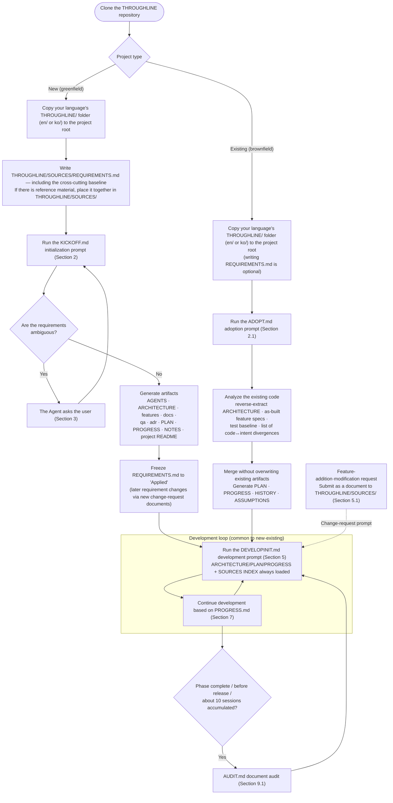

<div align="center">

# THROUGHLINE

**Spec-Driven Development for AI coding agents**

Personas debate every spec before code. A markdown + git memory keeps the
thread across sessions — so session 7 still remembers session 1's decision.

[](LICENSE)
[](../../releases)
[](../../stargazers)
[](#quick-start)

🌐 **English** · [한국어](README.ko.md)

[Quick Start](#quick-start) · [Benchmarks](#benchmarks) · [Why](#why) · [Team edition](README.team.md)

</div>

---

## The problem

Your agent forgets. Session 3 overwrites a decision from session 1, session 6
"restores the original" to a value that was never the original, and nothing in
the code comments says otherwise. The specs and the code quietly diverge.

## Benchmarks

Two runnable pilots in [`benchmark/`](benchmark/). Single-seed go/no-go checks — direction, not magnitude.

**Does memory of an early decision survive 7 sessions?** (original value: `7`)

| Memory regime | Restored | |
|---|---|---|
| **THROUGHLINE** (append-only SSOT) | **7** | ✅ |
| Free notes (~2600 char cap) | 7 | ✅ |
| Last-2-sessions notes (600 char) | 25 | ❌ *confidently wrong* |
| No memory | 10 | ❌ |

**Does SSOT curb vibe-coding drift?** (42 dev-agent sessions, composite /90)

| Prompt level | Baseline | THROUGHLINE | Δ |
|---|---|---|---|
| beginner | 70.4 | 76.0 | +5.6 |
| **intermediate** | 66.0 | **90.0** | **+24.0** |
| advanced | 84.3 | 90.0 | +5.7 |

**No prompt was pasted in either arm.** Each session the dev agent got a standing
instruction and a plain user request — so the +24.0 is what the standing contract
alone produces, not what a diligent user produces.

At the intermediate level the baseline silently complied with a request that
broke an earlier safety policy. THROUGHLINE caught the conflict, held the
policy, and surfaced it. → [full results & honest caveats](benchmark/RESULTS_SUMMARY.md)
· [method & per-pilot detail](#appendix-benchmark-detail-drift-suppression-pilots)

## Quick Start

**Nothing to install** — markdown files and git. No runtime, no CLI, no dependencies.

1. `git clone` this repository.
2. Copy the `THROUGHLINE/` folder **for your language** — `en/THROUGHLINE/` or `ko/THROUGHLINE/` — into your project root. (Not this guide.)
3. **New project:** write your requirements in `THROUGHLINE/SOURCES/REQUIREMENTS.md`. **Existing code:** skip this step.
4. Open your Agent in the project and paste **[the initialization prompt](#2-one-time-only-project-initialization-prompt)** — existing code uses **[the adoption prompt](#21-applying-to-a-project-already-under-development-adoption-prompt)** — then **[the development prompt](#5-prompt-to-start-actual-development)** to start building.

> All artifacts are generated inside `THROUGHLINE/`, so they never collide with your existing folders (docs/, etc.). Only `AGENTS.md` · `CLAUDE.md` and the project `README.md` are created or merged at the root.

After setup, `AGENTS.md` is loaded on every run, so you can keep working in plain conversation without pasting anything further → [Working without the prompts](#working-without-the-prompts).

---

## Team development? → THROUGHLINE Team

This guide (README) is the **Solo edition** — one developer, sequential. For **multiple developers and AI agents building the same codebase concurrently**, use the Team edition: **[README.team.md](README.team.md)** ([한국어](README.team.ko.md)).

---

## Why

**The limits of LLMs, and what this framework does about them.**

This guide is the user manual for the `THROUGHLINE/` folder — four prompts (`KICKOFF.md` · `ADOPT.md` · `DEVELOPINIT.md` · `AUDIT.md`) plus the input channel `SOURCES/` — used with Codex · Claude Code · Cursor Agent and the like.
This framework is an adaptation of Karpathy's LLM wiki proposal to a development workflow,
a design that **works around four intrinsic limits of LLMs (Agents) using a markdown file system**.
Before using it, start by understanding "what gets solved, and what does not."

### Limits that are overcome

| LLM limit | How this framework overcomes it |
|---|---|
| **Memory disappears when the session ends** | `PROGRESS.md` ("the first command of the next session"), `HISTORY.md`, and `NOTES.md` act as external memory → the next session picks up exactly where it left off |
| **The context window is finite** — not every document can be read every time | Four always-loaded files (AGENTS/ARCHITECTURE/PLAN/PROGRESS) + a per-session SOURCES/INDEX status check + indexes (features · docs · adr) enable **selective loading that cheaply picks only the documents needed** |
| **It re-derives every time** — repeating the same analysis and the same debugging session after session | A fact once discovered is "compiled" into `NOTES.md`, a decision once made into an ADR, a specification once agreed into `features/`, so it is not recomputed |
| **Plausible fabrication + silent drift** — disguising implementation mistakes as specifications, with documents and code gradually diverging | An authority-diagnosis rule (diagnose first when code↔specification disagree), atomic commits (code and documents always in the same state), and `AUDIT.md` (periodic recovery of drift) |

### Benefits

1. **Knowledge accrues compound.** In ordinary LLM work, context scatters as sessions pile up, but in this structure artifacts, notes, and decisions accumulate, so work gets cheaper the further you go.
2. **Traceability.** From the immutable originals in `THROUGHLINE/SOURCES/` → the source links in artifacts → the fixed-prefix history in `HISTORY.md`, you can always trace back "why did it become this way."
3. **Consistency.** Because the cross-cutting contract (`ARCHITECTURE.md`) is force-loaded every session, even if you build 10 features across 10 sessions, naming, error formats, and the authentication model do not waver.
4. **Interruption tolerance.** No matter where a session breaks off (whether during initialization or during development), the provisional PROGRESS record lets you resume at the exact point.
5. **Tool independence.** Since everything is markdown + git, memory is preserved no matter which Agent you switch to — Claude Code, Codex, or Cursor.

### Honest residual limits (these are not solved)

- **There is no guarantee in itself that the Agent follows the rules.** A prompt is an instruction, not an enforcement, and `AUDIT.md` only catches violations after the fact; it does not prevent them.
- **There is a documentation-maintenance cost.** The cost of updating PROGRESS/HISTORY/indexes on every task can outweigh the work itself for small one-off tasks.
- Therefore this framework is designed so that the benefit exceeds the cost on **medium-or-larger projects spanning multiple sessions**. For a one-off task of one or two sessions, it is reasonable not to adopt it.

> The **per-session token-usage baseline** you need to gauge adoption is summarized at the end of this document in [Appendix: Context cost](#appendix-context-cost-token-usage-baseline).

---

## Working without the prompts

You do not have to paste a prompt to get Spec-Driven Development. Initialization writes the standing contract into your project's root `AGENTS.md` (with `CLAUDE.md` as a safety net), and your agent loads it **on every run** — so ordinary back-and-forth conversation with Claude Code · Codex · Cursor still reads the SSOT (`ARCHITECTURE.md` · `PLAN.md` · `PROGRESS.md`), still checks a new request against the recorded decisions, and still records what changed. [Section 5.1.1](#511-making-changes-by-talking-to-the-agent-live-chat) covers how a chat instruction routes by impact. This is the mode the [benchmarks](#benchmarks) were run in.

Pasting a prompt buys a *guarantee* rather than a default. Two things lean on the agent's judgment when you only talk to it, and are worth an explicit prompt when they matter: the **persona review before a non-trivial spec** ([Section 5.3](#53-feature-addition-reviewdesign-prompt-choose-the-review-intensity)) and the **end-of-session handoff record** in `PROGRESS.md` ([Section 7](#7-prompt-to-continue-work-the-next-day-or-after-a-session-is-interrupted)). [`AUDIT.md`](#91-periodic-document-audit-auditmd) is the periodic net for whatever slipped through.

---

## 1. Basic file composition

This repository (THROUGHLINE) is composed of the following files.

```text
/  (THROUGHLINE repository = template)
├── README.md                            # This guide — the Solo edition. Not copied into projects
├── README.ko.md                         # Korean translation of this guide
├── README.team.md                       # Team edition guide (Korean: README.team.ko.md)
├── LICENSE                              # MIT
├── en/
│   ├── THROUGHLINE/                     # ★ English Solo kit. Copy this folder to your project root.
│   │   ├── KICKOFF.md                   # Prompt for new (greenfield) initialization
│   │   ├── ADOPT.md                     # Prompt for adopting into an existing (brownfield) project
│   │   ├── DEVELOPINIT.md               # Prompt for development progress
│   │   ├── AUDIT.md                     # Prompt for periodic document audit (drift check)
│   │   └── SOURCES/
│   │       ├── INDEX.md                 # Submitted-material index (REQUIREMENTS.md pre-registered)
│   │       └── REQUIREMENTS.md          # Initial requirements written by the user
│   └── THROUGHLINE-TEAM/                # ★ English Team kit. Copy this one instead for team development.
│       ├── KICKOFF.md · ADOPT.md · DEVELOP.md · INTEGRATE.md · AUDIT.md
│       ├── CONVENTIONS.md · SCHEMAS.md  # Structural conventions · frontmatter schemas
│       ├── templates/                   # workitem · conflict · assumption · session · team member
│       └── reference/                   # Solo-kit sections the team prompts cite
├── ko/
│   ├── THROUGHLINE/                     # Korean Solo kit — identical structure, Korean content
│   └── THROUGHLINE-TEAM/                # Korean Team kit — identical structure, Korean content
├── benchmark/                           # Maintainer-side evaluation harness. Not copied into projects
│   ├── RESULTS_SUMMARY.md               # Consolidated verdict across every benchmark item
│   ├── FINAL_REPORT.md                  # B1 · B2 · B3 detailed results
│   ├── METHODOLOGY.md                   # Design principles and pre-registration criteria
│   ├── benchmark-solo-pilot/            # Pilot 1 — does memory of an early decision survive?
│   ├── benchmark-vibe-solo/             # Pilot 2 — does SSOT curb vibe-coding drift?
│   └── harness/ · results/              # B3 revert-to-origin harness and its run artifacts
└── tests/
    └── conformance/                     # One-run pilots checking the prompts behave as specified
```

Each language folder is self-contained: every file inside is named canonically (`KICKOFF.md`, `ADOPT.md`, …), so once you copy the `THROUGHLINE/` folder for your language into your project root, all the prompts and their path references resolve regardless of which language you chose. You only ever copy **one** language folder.

When starting a project, clone this repository, then **copy the `THROUGHLINE/` folder for your language — `en/THROUGHLINE/` or `ko/THROUGHLINE/` — to your project root**. This guide (`README.md` / `README.ko.md`) is not copied.

- **New project (greenfield):** after copying, write the project requirements in `THROUGHLINE/SOURCES/REQUIREMENTS.md`
- **Project already under development (brownfield):** copy the folder the same way (writing REQUIREMENTS.md is optional, for when you want to record future goals)

Because the folder is named `THROUGHLINE`, it does not conflict with any folder in an existing project,
and all artifacts the Agent generates afterward (specifications, plans, QA, ADRs, etc.) are also created inside this folder.
If you have reference material such as external API specs or policy documents, place them together in `THROUGHLINE/SOURCES/` — they are read together during initialization.

Write the following to the extent possible.

- Project purpose
- Target users
- Core features (granularity guide: one feature = one user value; 3–7 recommended for the MVP)
- Features that must be included in the MVP
- Lower-priority features
- External APIs / external systems
- Data to be stored or analyzed
- Screen / UX requirements
- Authentication / authorization requirements
- **Cross-cutting (architecture) baseline** (common data-model rules, naming, API contract style, authentication model)
- Test / QA requirements
- Operations / deployment constraints

The role of each file is as follows.

| File | Role |
|---|---|
| `README.md` | The framework user manual (this document). For human reference; not copied into projects |
| `THROUGHLINE/SOURCES/REQUIREMENTS.md` | The initial-requirements input document written by the user (optional for brownfield). Frozen to `Applied` after initialization |
| `THROUGHLINE/SOURCES/INDEX.md` | Submitted-material index. REQUIREMENTS.md is pre-registered with type `Initial requirements` |
| `THROUGHLINE/KICKOFF.md` | Prompt for new-project initialization (greenfield) |
| `THROUGHLINE/ADOPT.md` | Prompt for adopting into a project already under development (brownfield). Generates documents in reverse from the code |
| `THROUGHLINE/DEVELOPINIT.md` | Prompt for actual development progress after initialization/adoption |
| `THROUGHLINE/AUDIT.md` | Periodic document-audit prompt. Checks document-code drift at Phase completion / before release / on long-term accumulation |

---

## 2. One-time only: project initialization prompt

After you finish writing `THROUGHLINE/SOURCES/REQUIREMENTS.md`, enter the following prompt into the Agent.

```text
Read THROUGHLINE/SOURCES/REQUIREMENTS.md and THROUGHLINE/KICKOFF.md, and carry out the project's initial setup following the instructions in KICKOFF.md.

REQUIREMENTS.md is the initial requirements written by the user, and KICKOFF.md is the initialization work instructions.
Generate all artifacts under THROUGHLINE/, except for AGENTS.md, CLAUDE.md, and the project README.md (the three root files).

Be sure to do the following.

1. Analyze THROUGHLINE/SOURCES/REQUIREMENTS.md and update its INDEX status to 'Under review'.
   If there is other submitted material (reference material, etc.) in THROUGHLINE/SOURCES/, read it together and register it in the INDEX.
2. Confirm whether the core requirements needed for project initialization are sufficient.
3. If the project purpose, target users, MVP features, user scenarios, data, external integrations, authentication/authorization, or QA criteria are ambiguous, ask the user before proceeding with initialization.
4. When questions are needed, write only the core questions, at most 5 at a time.
5. Organize the contracts common to multiple features (data model/naming/API/authentication) and generate THROUGHLINE/ARCHITECTURE.md.
6. Following the procedure in KICKOFF.md, generate the project structure and documents.
7. Generate the features/, docs/, qa/, personas/, adr/ documents under THROUGHLINE/. Include adr/INDEX.md, and
   write features/README.md and docs/README.md in the index (table of contents) format of KICKOFF.md Sections 6.2 and 7.2.
8. Generate ARCHITECTURE.md, PLAN.md, PROGRESS.md, HISTORY.md, ASSUMPTIONS.md, and NOTES.md under THROUGHLINE/, and
   generate AGENTS.md and CLAUDE.md at the project root (auto-recognition convention — paths inside are stated with the THROUGHLINE/ prefix).
8-1. Generate the project README.md (introduction/installation/run/structure/document links) at the root. Do not include sensitive information.
9. Write the feature documents based on the Multi-Agent review results, but write them not as a per-Agent transcript but as the final agreed feature specification, summarize the participating Agents and the key issues/conclusions in 3–4 lines, and link to the review log.
10. For QA, split the writing into per-feature test scenarios and the regression/manual/release checklists in the qa/ folder. Include the criterion that "test passing" is recognized only when the test is actually executed.
11. Before finishing initialization, change the status of REQUIREMENTS.md in THROUGHLINE/SOURCES/INDEX.md to 'Applied' and
    record the links to the applied artifacts. Afterward the REQUIREMENTS.md original is immutable, and
    additional requirements are received as new change-request documents.
11-1. Commit the initialization artifacts per KICKOFF.md Section 3.1 (one commit bundling the three root files + THROUGHLINE/;
    interim milestone commits are allowed if initialization spans multiple sessions).
12. When initialization is complete, report the list of generated files, the ARCHITECTURE summary, the list of feature specifications, the list of QA documents, the list of ADRs, the development Phase summary, and the command to start the next development session.
```

This prompt is **exclusively for the project's initial setup**.
At this step, actual implementation does not begin; the documents and plan needed to start development are generated.

> Initialization is a long, multi-step process and can be interrupted partway. The Agent updates the initialization progress state in `PROGRESS.md` at the end of each step, so if it is interrupted, you can continue with the same prompt.

### 2.1 Applying to a project already under development (adoption prompt)

If this is not a new project but **a project that already has code**, use `ADOPT.md` instead of `KICKOFF.md`.
`ADOPT.md` does not work from requirements but **analyzes the existing code and reverse-documents the current state**,
and since the artifact structure is identical to `KICKOFF.md`, once adoption is complete you continue development directly with `DEVELOPINIT.md`.

```text
Read THROUGHLINE/ADOPT.md and, following its instructions, adopt (apply) the framework into this project that is already under development.

Generate all artifacts under THROUGHLINE/, except for AGENTS.md, CLAUDE.md, and the project README.md (the three root files).
Do not touch same-named folders in the existing project such as docs/.

Be sure to keep the following.

1. At this step, do not modify code. This is the step of documenting the current state and making a development plan.
2. First, check whether there are existing artifacts in THROUGHLINE/ (if there are, the project is already adopted — do not re-adopt; report instead).
   Next, inventory whether README/AGENTS/CLAUDE/.gitignore exist at the root.
   Do not overwrite files that already exist — merge them, or if you must overwrite, get confirmation.
3. First, scan the codebase to identify the stack, build/run/test commands, structure, entry points, dependencies, and environment-variable names.
   (Do not collect or record environment-variable values/secrets.)
4. Then, starting from the entry points, directly read the actual implementation and core paths of the major features and trace the behavior.
   Do not guess the behavior from file names/structure alone, and do not stop at a metadata scan.
   State the ranges you read and the ranges you did not read, and leave the unread areas in THROUGHLINE/PROGRESS.md.
5. Reverse-extract the actual conventions (naming/API contract/error format/authentication/data model) from the code you read and create THROUGHLINE/ARCHITECTURE.md.
   Do not invent items that cannot be determined from the code; leave them in THROUGHLINE/ASSUMPTIONS.md (active, needs verification).
6. Write the implemented features as as-built specifications in THROUGHLINE/features/*.md.
   Each behavioral claim must be backed by a source code location (file/function), and for behavior you did not read directly, do not assert it; mark it "estimated (needs verification)".
   Mark separately the points where code and intent diverge.
7. Actually run the existing tests and record the baseline (pass/fail/absent) in THROUGHLINE/HISTORY.md.
8. Make THROUGHLINE/PLAN.md reflect the current state as done/in progress/remaining, and write the first command of the next session in THROUGHLINE/PROGRESS.md.
9. If THROUGHLINE/SOURCES/REQUIREMENTS.md exists, use it as future goals/unimplemented requirements, and if it conflicts with as-built, ask.
   When adoption is complete, register it in THROUGHLINE/SOURCES/INDEX.md with type 'Initial requirements' and freeze it to 'Applied'.
9-1. Commit the adoption artifacts on a work branch per ADOPT.md work-order step 18 (documentation-only commit — no code changes).
10. When adoption is complete, report the results in the format of ADOPT.md Section 7 (including the ranges read, the list of code↔intent divergences, and the test baseline).
```

> Adoption is also a long, multi-step process that can be interrupted. Since `PROGRESS.md` is updated after each step, if it is interrupted, you can continue with the same prompt.

### 2.2 Kit upgrade (applying a new version to an already-applied project)

Use this when reflecting template updates into a project that has already applied THROUGHLINE.
**Do not re-run KICKOFF/ADOPT** — the re-initialization/re-adoption guard blocks them, and bypassing it overwrites artifacts.

Processing principles:

| Category | Target | Processing |
|---|---|---|
| Kit-owned (no project content) | The four prompts in `THROUGHLINE/` | **Overwrite-copy** with the new version |
| Generated artifacts (with project content) | features/, PLAN, PROGRESS, HISTORY, ASSUMPTIONS, SOURCES originals | **Preserve content** — do not touch |
| Rule files (generated by old-version rules) | root `AGENTS.md`, `CLAUDE.md` | **Merge-update** — add only missing blocks |
| New structure (absent in old version) | TODO.md, NOTES.md, personas/, discussion/, etc. | **Newly create/augment** |

**Step 1 (human):** Pull the template repository and overwrite-copy the four prompts (KICKOFF/ADOPT/DEVELOPINIT/AUDIT)
**from the same language folder you originally used** (`en/THROUGHLINE/` or `ko/THROUGHLINE/`) into the project's `THROUGHLINE/`.
(If the old version had a flat root structure, first make a commit that `git mv`s the artifacts — excluding the three root files — under `THROUGHLINE/`.)

**Step 2 (Agent):** Run the prompt below.

```text
The THROUGHLINE template has been updated and the four prompts have been replaced with the new version.
Upgrade this project's artifact structure to the new-version standard.
Do not re-run KICKOFF or ADOPT (re-initialization/re-adoption forbidden). Preserve the content of existing artifacts.

1. Compare the structure in Section 1 of the new THROUGHLINE/KICKOFF.md against the current THROUGHLINE/ and identify missing files/folders.
2. Generate the missing items.
   - NOTES.md / TODO.md: empty skeletons (KICKOFF.md Sections 15.1·15.3 format)
   - SOURCES/INDEX.md: create it if absent, and if present, augment the type/status columns to the 15.2 format.
     If an existing requirements document is present, register it with type 'Initial requirements', status 'Applied'.
   - personas/: per KICKOFF.md 5.2, generate the persona instances and INDEX needed for this project
     (read ARCHITECTURE.md and include project-specific checklists; do not copy knowledge — links only).
   - discussion/: create the folder only (apply from the next review onward).
3. Merge-update the root AGENTS.md against the standard of Sections 9·10 of the new KICKOFF.md.
   Preserve the existing project-specific content, and add only the missing principle blocks (path prefix/NOTES/SOURCES/TODO/review log/language·recording scope).
   The descriptive prose of the merge result must follow the language standard (the primary language of REQUIREMENTS.md) —
   if the existing content is in a different language, preserve the meaning and translation-merge it; do not concatenate it with languages mixed.
   If there is a conflict, do not overwrite; present a diff and get confirmation.
3-1. The root CLAUDE.md is not merged but **replaced** with the new KICKOFF.md Section 11 template (malfunction-prevention only).
   However, keep the lossless gate: first confirm that each rule being removed exists in AGENTS.md, and
   if it does not, add it to AGENTS.md before removing. Preserve project-specific custom rules by translating them into the prescribed language.
4. Do not modify the content of existing artifacts (features/PLAN/PROGRESS/HISTORY/ASSUMPTIONS).
   However, if an index such as features/README.md differs from the new format (6.2), conform only the format while preserving the content.
5. Record it in HISTORY.md as a `## [YYYY-MM-DD] chore | Framework upgrade` entry, and
   bundle the entire change into a single commit.
6. Report the list of files updated/created/augmented and any conflicts that need manual confirmation.
```

**Step 3 (verification):** Running the document-audit prompt (Section 9.1) right after the upgrade
performs the index-integrity/link/missing checks against the new standard and catches any migration omissions.

---

## 3. When requirements are ambiguous at the initialization step

At the initialization step, the quality of requirements matters.
If the following items are ambiguous, the Agent must not guess arbitrarily; it must ask the user.

- Project purpose / target users / core MVP features / core user scenarios
- The purpose of external API / external system integrations
- Data to be stored or analyzed
- Sensitive information / personal information / security requirements
- Authentication / authorization / admin features
- The broad direction of the data model and authentication model (the ARCHITECTURE baseline)
- Test / QA criteria
- Deployment environment / operations constraints
- The distinction between MVP and lower-priority features

Conversely, detailed defaults such as file names, folder structure, code style, common test tools, local development environment configuration, and **detailed naming-notation rules** are not asked of the user; they are recorded in `ASSUMPTIONS.md` (or `ARCHITECTURE.md`) and then proceeded with.

Example question:

```text
Confirmation is needed for project initialization.

After analyzing THROUGHLINE/SOURCES/REQUIREMENTS.md, the following must be confirmed before creating the initial feature specifications and development plan.

1. What are the three features that must be included in this project's MVP?
2. Among general users, administrators, and operators, who are the primary users?
3. For external API integration, what is the authentication method and call frequency?

Once you provide answers, I will reflect them and continue with initialization.
```

### 3.1 Delegate unknown items to the AI (`[AI-delegated]`)

For items you do not know the answer to or find hard to decide, instead of leaving them blank you can write `[AI-delegated]` (aliases `[Delegate to AI]`, `[Unknown]`). The Agent handles them differently depending on risk.

- **Non-core items** (naming, code style, non-core UI, log format, etc.): proceed with a reasonable default and record it in `ASSUMPTIONS.md`. It does not ask.
- **Core items** (MVP scope, data model, authentication/authorization, personal information, external integrations, etc.): without stopping initialization, it provisionally adopts the **most conservative and most easily reversible choice**, records it in `ASSUMPTIONS.md`, and collects it under **"Items decided by AI delegation (review recommended)"** in the initialization report. The user can confirm/modify them later.

However, two things cannot be delegated. **If you leave or delegate both the project purpose and the core features** (so that there is no "what this project even is"), the Agent will not accept the delegation and will ask. Also, for items where **cost, payment, legal impact, or hard-to-reverse behavior** is at stake, even if delegated, it does not decide silently; it chooses a conservative default and then requests confirmation.

The same applies in the development step. If you delegate in a prompt with "just handle this for me," the autonomous-decision scope for that item widens, but core items are decided conservatively and left in `ASSUMPTIONS.md` and the completion report.

> 📝 **Writing the requirements:** the [`REQUIREMENTS.md` template](en/THROUGHLINE/SOURCES/REQUIREMENTS.md) carries its own in-file guide — which items to fill in first, the `[AI-delegated]` marker, and a **tip on attaching reference material** (capture a target design or API doc into `SOURCES/` and reference it from the document, instead of describing it in prose). Skim it before you start writing.

---

## 4. Documents generated after initialization is complete

When initialization is complete, the following structure is generally generated.

```text
<project root>
├── README.md                # Project README — fixed at root (artifact)
├── AGENTS.md                # Agent work instructions — fixed at root (tool auto-recognition convention)
├── CLAUDE.md                # Claude Code auto-load — fixed at root
├── THROUGHLINE/             # ★ Everything the framework owns and manages
│   ├── KICKOFF.md / ADOPT.md / DEVELOPINIT.md / AUDIT.md
│   ├── ARCHITECTURE.md
│   ├── PLAN.md
│   ├── PROGRESS.md
│   ├── HISTORY.md
│   ├── ASSUMPTIONS.md
│   ├── NOTES.md
│   ├── TODO.md
│   ├── SOURCES/
│   │   ├── INDEX.md
│   │   ├── REQUIREMENTS.md
│   │   └── *.md / *.pdf / *.txt / *.html
│   ├── features/
│   │   ├── README.md
│   │   └── *.md
│   ├── docs/
│   │   ├── README.md
│   │   └── *.md
│   ├── qa/
│   │   ├── README.md
│   │   ├── regression-checklist.md
│   │   ├── manual-test-cases.md
│   │   └── release-checklist.md
│   ├── personas/
│   │   ├── INDEX.md
│   │   └── *.md
│   ├── discussion/
│   │   └── review-*.md
│   └── adr/
│       ├── INDEX.md
│       └── *.md
└── (project code — existing folders are not touched)
```

The role of each document is as follows. (The paths in the table are all relative to `THROUGHLINE/`, except the three root files.)

| File / folder | Role |
|---|---|
| `README.md` | **Project README** (artifact). Project introduction/installation/run/structure/document links. Updated per push |
| `AGENTS.md` | The work instructions the Agent references on every run |
| `CLAUDE.md` | Claude Code auto-load file. References AGENTS.md + **a safety net for malfunction-prevention rules only** (workflow rules have AGENTS.md as their single source) |
| `ARCHITECTURE.md` | The **cross-cutting contract** (data model/naming/API/authentication). Always loaded in every development session |
| `PLAN.md` | The overall development Phases and completion criteria |
| `PROGRESS.md` | The current progress state and the first command of the next session |
| `HISTORY.md` | Work history (`## [date] type \| title` fixed prefix; archived when it grows long) |
| `ASSUMPTIONS.md` | Content the Agent decided autonomously (including status/conflict management) |
| `NOTES.md` | Topical accumulation of non-trivial **facts** learned during development (guesses go to ASSUMPTIONS) |
| `TODO.md` | **Backlog** — a collection box for items not yet decided to start (category/priority/status/promotion-target links). Selectively loaded; the truth of progress state is the PLAN · features index |
| `THROUGHLINE/SOURCES/INDEX.md` | User-submitted-material index (type/submission date/status/summary/applied artifacts) |
| `THROUGHLINE/SOURCES/*` | User-submitted originals — reference material/change requests (immutable after Applied; changes are added as new documents) |
| `features/README.md` | Feature index (status/Phase/related ADR table) |
| `features/*.md` | The final per-feature feature specification (includes a review summary) |
| `docs/README.md` | User-documentation index |
| `docs/*.md` | Documents for users / operators |
| `qa/*.md` | QA operations, regression test, manual QA, release checklist |
| `personas/INDEX.md` | List of persona instances (responsible perspective/file/creation date) |
| `personas/*.md` | Review persona definitions with project context injected (checklist + links only; loaded only during review) |
| `discussion/review-*.md` | Records of the deliberation process of Multi-Agent reviews (immutable, normally not loaded — opened only during disputes/audits) |
| `adr/INDEX.md` | ADR list index |
| `adr/*.md` | Records of important design decisions |

---

## 5. Prompt to start actual development

When starting actual development after initialization is complete, enter the following prompt.

```text
Read AGENTS.md and THROUGHLINE/DEVELOPINIT.md, and start actual development based on the current project documents.

The framework documents are all inside THROUGHLINE/, except the root AGENTS.md/CLAUDE.md/README.md.

Be sure to proceed in the following order.

1. Read AGENTS.md (root).
2. Read THROUGHLINE/ARCHITECTURE.md. (cross-cutting contract — always loaded)
3. Read THROUGHLINE/PLAN.md.
4. Read THROUGHLINE/PROGRESS.md and check the "first command of the next session."
4-1. Check THROUGHLINE/SOURCES/INDEX.md (always checked): if there are Not-applied / Under-review change requests, report them.
5. To the extent needed, check THROUGHLINE/HISTORY.md for whether something has been implemented redundantly.
6. Check THROUGHLINE/features/README.md and THROUGHLINE/adr/INDEX.md.
7. Selectively read only the feature documents related to the current Phase and the related ADRs.
8. Read THROUGHLINE/qa/README.md, and selectively check only the QA documents needed for the current work.
9. If THROUGHLINE/NOTES.md has items related to the current work topic, check them.
10. Following the procedure in DEVELOPINIT.md, implement the current Phase.

Cautions:

- Do not re-initialize the project based on THROUGHLINE/SOURCES/REQUIREMENTS.md (Applied).
  Receive new requirements as change-request documents in THROUGHLINE/SOURCES/ and process them per DEVELOPINIT.md 4.2.
- THROUGHLINE/'s ARCHITECTURE.md, PLAN.md, PROGRESS.md, and the SOURCES/INDEX.md status check are always performed. Read only the feature/QA documents needed for the current Phase.
- Follow common decisions (data model/naming/API/authentication) according to ARCHITECTURE.md.
- Do not implement by guessing without a specification.
- If code and specification differ, first diagnose which side is authoritative, then handle it. Do not disguise an implementation mistake as the specification.
- Actually run the tests and record the results in HISTORY.md. Do not claim a pass without running.
- Record non-trivial facts learned during development in NOTES.md. Record guesses in ASSUMPTIONS.md.
- If THROUGHLINE/SOURCES/INDEX.md has Not-applied/Under-review change requests, report them and confirm whether to process them first.
- Write document cross-references as relative-path links, and when changing feature/docs/ADR, update the corresponding index in the same commit.
- When starting work, provisionally record the progress state and the first command of the next session in PROGRESS.md.
- When a meaningful unit of work is complete, bundle code + documents into a single commit and commit. Push follows the project's push policy (default: commit only, no automatic push).
- Direct push to main/master is forbidden.
- After completing the work, update ARCHITECTURE.md (if changed), PLAN.md, PROGRESS.md, and HISTORY.md.
- On push, if there is any impact on users/installation/run/architecture, update the project README.md in the same commit.
```

This prompt is **for starting actual development**.

### 5.1 Requesting feature additions / feature modifications during development (how to use THROUGHLINE/SOURCES/)

If, after initialization, you need to add a new feature or modify an existing feature/architecture, do not explain it in conversation alone;
write the request as a document (md recommended, pdf/txt/html allowed) and place it in the project's `THROUGHLINE/SOURCES/` folder.
Because the original is preserved, you can later trace "why was it changed this way."

**Summary of THROUGHLINE/SOURCES/ folder rules** (details: KICKOFF.md 15.2; application procedure: DEVELOPINIT.md 4.2):

- There are two document types. **Reference material** (a record of facts: API specs, policy documents) and
  **change requests** (a record of intent: feature additions/modifications, architecture changes).
- A submitted original is **immutable**. Do not edit a document once it is applied; if the content changes, **add a new document**.
  The previous document is marked `Superseded` in `THROUGHLINE/SOURCES/INDEX.md` (immutable, append-only).
- Every document is registered in `THROUGHLINE/SOURCES/INDEX.md` and managed by status (`Not applied`/`Under review`/`Applied`/`Rejected`/`Superseded`).
- A change request **is not authoritative until it is Applied.** Once a request is reviewed and applied, it is not read again,
  and from then on the applied ARCHITECTURE/features/ADR carry the truth.

**Change-request document template** (partially reusing the corresponding section of THROUGHLINE/SOURCES/REQUIREMENTS.md):

```md
# Change request: <title>

## 1. Background / Purpose

## 2. Features to add/modify (follow the REQUIREMENTS.md Section 3 granularity guide)

## 3. Estimated impact scope (only as much as you know — if unknown, [AI-delegated])

## 4. Whether the cross-cutting baseline is affected (data model/naming/API/authentication — if unknown, [AI-delegated])

## 5. Priority / desired schedule
```

**Feature-addition / feature-modification instruction prompt:**

```text
I have submitted THROUGHLINE/SOURCES/<file-name> as a change request.

Read AGENTS.md and THROUGHLINE/DEVELOPINIT.md, and process this submitted material following the DEVELOPINIT.md 4.2 procedure.

Be sure to keep the following.

1. Register it in THROUGHLINE/SOURCES/INDEX.md (type: Change request, status: Not applied → Under review).
2. Read the document and perform a summary and impact analysis (ARCHITECTURE conflicts, affected features, whether an ADR is needed).
3. If a change to MVP scope, data model, authentication/authorization, or cross-cutting contract is needed, confirm with the user before applying.
4. If the feature scope changes, perform a Multi-Agent re-review, and write an ADR for cross-cutting contract changes.
5. When applying, update the features/ARCHITECTURE/PLAN documents (and docs/qa if needed), and
   leave the source (THROUGHLINE/SOURCES/<file-name>) as a relative-path link in each artifact.
6. Change the INDEX status to 'Applied' only when all items have been reflected in the documents.
   If only partially applied, leave it 'Under review' and record the remaining items in PROGRESS.md.
7. This work is an incremental application. Do not re-initialize the project.
8. Do not modify the original document. If this request modifies a previous request,
   mark the previous document 'Superseded' in the INDEX.
9. When the application is complete, confirm whether to continue to implementation in the same session, or to do only the application (documents).
```

**Reference-material submission prompt** (registration/summary only, with no change work):

```text
I have submitted THROUGHLINE/SOURCES/<file-name> as reference material.

Following the THROUGHLINE/DEVELOPINIT.md 4.2 procedure, register it in THROUGHLINE/SOURCES/INDEX.md (type: Reference material),
read the document, and record a summary in the INDEX.
At this step, do not do any feature-change work.
If there is a place in a related feature/ARCHITECTURE document that should reference this material as evidence, add only a link.
```

### 5.1.1 Making changes by talking to the agent (live chat)

You don't always have to write a document. You can also request a change just by telling the agent in chat — the framework routes by impact (`DEVELOPINIT.md` 4.2.1):

- **Small / non-core changes** (wording, non-core UI, an internal tweak): say it in chat and the agent makes the change, recording the decision in `ASSUMPTIONS.md` / `HISTORY.md`. No document needed.
- **Core / cross-cutting changes** (MVP scope, data model, authentication/authorization, the `ARCHITECTURE.md` contract): a chat instruction *starts* the work but does **not** let the agent skip the record. The agent confirms with you first, then reflects the change into the artifacts (ARCHITECTURE / features / ADR) within the same work — and from then on the **artifact**, not the chat message, is the source of truth.
- **When you want traceability** ("why did we change this months ago?") or the change is large/contentious: prefer the document channel in Section 5.1. The submitted original is preserved, so the reason survives.

> **Authority note.** A chat instruction authorizes **the change it describes** — it does not activate a `SOURCES/` change-request document that is still `Not applied` / `Under review`. A dormant request document carries no authority until it is `Applied` (KICKOFF.md 15.2).

### 5.2 How to use the backlog (TODO.md)

For ideas at the "would be nice to do later" level during development, instead of writing a change-request document, instruct registration in one line.

```text
Register this feature in the TODO: <one-line description>
```

- The Agent classifies it by category (feature/improvement/bug/tech debt) and registers it in `THROUGHLINE/TODO.md`
  as a single line (content · priority · status `Pending` · registration date) and commits.
- **Registration is not starting.** To implement it, instruct "start the <item> in the TODO" —
  trivial items go straight to a feature document, and items with cross-cutting impact are promoted to a SOURCES/ change request
  for processing (THROUGHLINE/DEVELOPINIT.md 4.3). On promotion, the promotion target is linked in the TODO.
- The TODO is a **backlog (collection box), not a status board.** The truth of progress state is PLAN.md and
  features/README.md, and the specification is written in features/, not in the TODO.
- Items decided not to do are not deleted; they are left as `On hold`/`Dropped` (with a reason). AUDIT checks neglected items.

### 5.3 Feature-addition review/design prompt (choose the review intensity)

When starting the design review of a new feature, even a one-line instruction like "review and design the addition of the OOO feature"
*should* route the Agent into the review system, *but* because a prompt is an instruction and not an enforcement, the review can be skipped.
**Explicitly invoking** the review system as below makes it hard to skip. Choose among the three intensities depending on the situation.

| Situation | Method |
|---|---|
| A lightweight feature, with any Agent tool | **Method 1** — explicit invocation of the standard review (role-play) |
| An important/contentious feature, in a subagent-supported environment (Claude Code, etc.) | **Method 2** — actual parallel deliberation by subagents |
| An official requirement that could touch MVP scope/the cross-cutting contract | **Method 3** — SOURCES/ change request (Section 5.1) + combined with Method 1 or 2 |

**Method 1 — explicit invocation of the standard review** (cost: 1 session):

```text
Review and design the addition of the OOO feature. Do not start implementation.

1. Follow AGENTS.md and THROUGHLINE/DEVELOPINIT.md Section 6 (Multi-Agent review).
2. From THROUGHLINE/personas/INDEX.md, pick and inject the persona instances related to this feature, and
   if a needed perspective is missing, create a new instance per the KICKOFF.md 5.2 standard.
3. Record the deliberation process in THROUGHLINE/discussion/review-<feature-slug>-YYYYMMDD.md.
   Leave each persona's risks/evidence, and the Research Agent must always record its sources as full URLs (verbatim) or SOURCES/ paths.
4. As the agreed proposal, write a draft feature document (KICKOFF.md 6.1 template).
   If there is impact on MVP scope/data model/authentication/cross-cutting contract, request confirmation before applying.
5. Report the review summary (participating personas / key issues / conclusion in 3–4 lines + log link) and the design proposal.
```

**Method 2 — actual parallel deliberation by subagents** (judgment independence + Research's actual tool use; cost: N× tokens):

```text
Review and design the addition of the OOO feature. Do not start implementation.
Run the persona deliberation as actual subagents in parallel, not as role-play.

1. Select 3–5 related personas from THROUGHLINE/personas/INDEX.md.
2. Using each persona-instance file as the role definition, spin up one subagent at a time, and
   have each review independently without seeing one another's output
   (each: discovered risks / evidence·sources / proposal. The Research role performs actual research and states its sources).
3. Aggregate the results, organize the issues and conflicts, and derive an agreed proposal.
   For issues that cannot be reasonably agreed, attach the options and a recommendation and confirm with the user.
4. Record the entire deliberation process in THROUGHLINE/discussion/review-<feature-slug>-YYYYMMDD.md
   (with instance-file links in the participating-personas item, execution mode `parallel-subagents`, and
   per-subagent evidence — identifier·input scope·output summary), write a draft feature document, and report.
```

> Why Method 2 is possible: a `personas/` instance file is itself the subagent's role definition (system prompt), and
> the `discussion/` log **format** is identical regardless of the execution method (role-play / actual parallel) (see Section 9.2).
> But an identical format does not mean you may report role-play as actual parallel — **state the actual execution mode in the log with the 4.1 enum** (`role-play` / `parallel-subagents` / `parallel-external`), and for `parallel-*` record the per-subagent evidence (KICKOFF 4.1).
> If subagent tools are unavailable, do not imitate Method 2; fall back to Method 1 (role-play), and do not report independent parallel review you did not perform.

**Method 3 — combine with a formal change request**: after submitting a change-request document to `THROUGHLINE/SOURCES/` as in Section 5.1,
add `This review is the application process of the SOURCES/<file-name> change request.` as the first line of the Method 1 or 2 prompt.
The entire process of impact analysis → confirmation → review → application is left with source tracing.

---

## 6. Criteria for asking the user during development

In the development step, the Agent does not ask on every minor implementation decision (internal function names · file locations · test/mock data · non-core UI placement · small refactorings · QA checklist supplements, etc.); it proceeds autonomously based on the already-generated `AGENTS.md` · `ARCHITECTURE.md` · `PLAN.md` · `PROGRESS.md` · `features/*.md` · `qa/*.md`. Autonomous decisions are recorded in `ASSUMPTIONS.md` (including a conflict check against existing assumptions).

It asks **only when a decision completely different from the existing planning intent is needed** — MVP scope, fundamental changes to the data model/authentication/authorization/security, the core UX flow, changes to the **cross-cutting contract in ARCHITECTURE.md**, replacement of an external-integration method, and destructive changes with cost/payment/legal impact or that are hard to reverse.

> This section is **a summary of what the user should expect.** The authoritative source of the judgment criteria the Agent follows is in `DEVELOPINIT.md` · `AGENTS.md`.

---

## 7. Prompt to continue work the next day or after a session is interrupted

```text
Read AGENTS.md and THROUGHLINE/DEVELOPINIT.md, and continue the previous work based on the "first command of the next session" in THROUGHLINE/PROGRESS.md.

Read THROUGHLINE/'s ARCHITECTURE.md and PLAN.md together to re-align the cross-cutting contract.
Do not redo work that is already complete. Check THROUGHLINE/HISTORY.md (and the archive) to prevent redundant implementation.
Read only the feature documents related to the current Phase and the related ADRs, and continue development.
Check only the QA documents needed for the current work.

When starting work, provisionally update the progress state in PROGRESS.md, and
when the work is done, update PLAN.md, PROGRESS.md, HISTORY.md, and ASSUMPTIONS.md, bundle code + documents, and commit (push follows the project's push policy).
```

---

## 8. How QA proceeds

QA is split into two steps — **per-feature test scenarios** (`features/*.md`) and **the overall regression · manual QA · release checklist** (`qa/*.md`).

During development, the Agent checks the current feature's test scenarios to write and **actually run** automated tests, fixes failures, then judges the regression impact and whether manual QA is needed, and records the run/QA results in `HISTORY.md` · `PROGRESS.md`.

> **"Test passing" is recognized only when the test is actually run and the result is recorded.** If deployment/release work is included, `qa/release-checklist.md` is checked. (The authoritative source of the detailed procedure is `DEVELOPINIT.md`.)

### 8.1 Updating the project README.md (per push)

The project `README.md` is an artifact that holds "what this project is and how to install/run it" (a separate document in a different repository from the guide `README.md` of the THROUGHLINE repository).

- **Creation**: at initialization, KICKOFF creates a draft based on `ARCHITECTURE.md` / `features/` / `PLAN.md`.
- **Update timing**: not on every commit, but **the need for an update is checked per push**. If the following have changed, the README change is included in the same atomic commit.
  - Project introduction / feature list (a new feature completed, etc.)
  - Installation / run / build methods, dependencies, environment-variable **names** (values/secrets must never be recorded)
  - Project structure, links to major documents (docs/, etc.)
  - User-facing matters of `ARCHITECTURE.md` (e.g., supported environments)
- **No update needed**: if there is no impact on users/installation/run — internal refactoring, test-only changes, non-core UI fine-tuning, etc. — the README is not touched.
- The README is not an always-loaded baseline document but a **derived artifact**. The source of truth is `ARCHITECTURE.md`/`features/`, and the README summarizes and links to them.

---

## 9. Consistency-maintenance mechanism (the core of this version)

To keep the development direction from wavering even as features and sessions pile up, the following are used.

```text
ARCHITECTURE.md   → the contract common to all features, in one place. Always loaded every session.
adr/INDEX.md      → a list of important decisions. A selective-loading session cheaply discovers the relevant decision.
features/README.md → feature index (status/Phase/ADR). Cheaply selects which feature document to read.
PROGRESS (provisional record) → even if a session is interrupted, the next session picks up exactly.
atomic commit      → code and documents always remain in the same state.
authority-diagnosis rule → does not arbitrarily erase a code-specification mismatch. Drift prevention.
HISTORY rotation   → manages the context burden without losing history.
NOTES.md          → compound accumulation of learned facts. Does not rediscover the same fact.
THROUGHLINE/SOURCES/INDEX.md  → lifecycle tracking of submitted material (Not applied → Applied/Rejected/Superseded). Original immutable, append-only,
                    once a change request is applied, the artifacts carry the truth.
AUDIT (periodic audit)   → periodically recovers the gradual drift that the recording-time checks missed.
```

Core principle: **common decisions go in ARCHITECTURE.md, important decisions in ADRs, progress state in PROGRESS, history in HISTORY, learned facts in NOTES.** A feature document holds only that feature's own specification.

### 9.1 Periodic document audit (AUDIT.md)

Recording-time conflict checks alone cannot catch the drift that arises as sessions accumulate (an un-updated PLAN, an assumption that should have been retired, a specification that diverges from the code, an index omission).
Run the prompt below at the points of **right after a Phase completes / before a release / on a long-delayed resumption / about 10 sessions of accumulation**.

```text
Read THROUGHLINE/AUDIT.md and, following its instructions, audit the drift between the project documents and the code.
The framework documents are all inside THROUGHLINE/, except the three root files (README/AGENTS/CLAUDE).

Be sure to keep the following.

1. At this step, do not modify feature code. This is the check/record step.
2. Mechanical mismatches such as index omissions and broken links are fixed immediately and included in the audit commit.
3. Do not fix semantic mismatches between code and specification; organize them as a list of findings.
   Handling is split off as separate development work following DEVELOPINIT.md 3.4 (authority diagnosis).
4. Check the active assumptions in ASSUMPTIONS.md for any that should have been confirmed/retired.
5. Record the audit results in HISTORY.md as an audit entry, and reflect follow-up work in PROGRESS.md.
6. Report in the format of AUDIT.md Section 5.
```

### 9.2 Multi-Agent review system (personas/ + discussion/)

Feature-specification writing and design-change reviews proceed by way of multiple personas deliberating,
and the following system is used to prevent "skipping the review and just writing a plausible conclusion."

```text
personas/*.md          persona instances — perspective definitions with project context injected. Loaded only during review.
      ↓ (injected during review)
discussion/review-*.md deliberation-process record — per-persona risks·evidence/sources·issues·conclusions. Immutable, normally not loaded.
      ↓ (only the conclusions are reflected)
features/*.md          a 3–4-line review summary (participants/key issues/conclusion) + log link. Important decisions split off into adr/.
      ↓ (spot-check verification)
AUDIT.md 3.10          sources are full URLs that really exist · personas exist and meet the specificity floor (≥3 project links) · the execution mode is enum + evidence-backed · issues are status-tagged and risks traced to tests · the log is not theatrical.
```

**Personas (personas/)** — KICKOFF.md Section 5:

- At initialization, from the catalog (PM/Research/Architect/DB/Backend/Frontend/Security/QA, etc., 10 kinds),
  pick **only those the project needs (usually 4–7)** and generate them as instance files with project-specific checklists
  (each instance carries **≥3 project-specific links** — the 5.2 specificity floor).
- An instance holds only the perspective·checklist·reference links. It **does not copy the knowledge** of ARCHITECTURE/NOTES (maintaining a single source).
- At review points where issues·research·choices are needed, pick from the INDEX and read/inject only that file. When a new perspective is needed, add it then.

**Deliberation record (discussion/)** — KICKOFF.md 4.1:

- When reviewing a non-trivial feature, the entire deliberation process is recorded in `discussion/review-<feature-slug>-YYYYMMDD.md`
  in a structured format (participating personas/per-persona review/issues and conflicts/conclusions and where reflected).
- **Evidence·source obligation**: the Research Agent in particular must always record its sources — web sources as the **full, resolvable URL preserved verbatim in the log** (not abbreviated/name-only), submitted material as a `SOURCES/` path — and
  if it cannot, it records "could not perform research." Research results without sources cannot be asserted.
- The log is **immutable·append-only** (a new file on re-review), and it is not loaded in normal sessions, so it has **no fixed token cost**.
- The log is not the "evidence" of the review but **a device that enforces the performance and enables spot-check verification.**
  AUDIT opens a sample and cross-checks whether the sources are full URLs that really exist and whether the personas really exist.

Trivial features (simple CRUD · static screens) omit the persona deliberation·log and are marked "simple feature — no additional review needed."

---

## 10. Usage flow summary

New (greenfield) and existing (brownfield) **differ only in the initialization path; the subsequent development loop is identical.**



---

## 11. Criteria for choosing a prompt

| Situation | Prompt to use |
|---|---|
| Starting a new project for the first time | Initialization prompt (Section 2, KICKOFF.md) |
| Applying to a project already under development | Adoption prompt (Section 2.1, ADOPT.md) |
| Starting development after generating feature specifications and documents | Prompt to start actual development (Section 5) |
| Continuing previous work | Prompt to continue work (Section 7) |
| Requesting, as a document, a new feature addition or an existing feature modification during development | Change-request processing prompt (Section 5.1, THROUGHLINE/SOURCES/) |
| Registering reference material such as external specs/policy documents | Reference-material submission prompt (Section 5.1, THROUGHLINE/SOURCES/) |
| Lightly jotting down an idea / managing and starting the backlog | TODO registration·promotion (Section 5.2, THROUGHLINE/TODO.md) |
| Starting the design review of a new feature (choose the review intensity) | Feature-addition review·design prompt (Section 5.3 — standard/subagent/change-request combination) |
| Upgrading the kit to a new version (an already-applied project) | Upgrade prompt (Section 2.2) |
| Phase completion / before release / when document-code drift is suspected | Document-audit prompt (Section 9.1, AUDIT.md) |

---

## Appendix: Benchmark detail (drift-suppression pilots)

The headline numbers are in [Benchmarks](#benchmarks) at the top. This appendix holds the method, the per-pilot detail, and — deliberately kept — what these pilots do **not** establish.

The framework's central claim — that an external, structured memory (SSOT) curbs the **silent intent-drift** that plain LLM sessions suffer — is testable. Two runnable pilots in this repository measure it. Both are **single-seed go/no-go discrimination checks, not statistically powered results** (a powered claim needs ≥3 seeds across multiple tasks); they show *direction*, not magnitude. Each is fully reproducible (sandboxed dev-agents, a hidden oracle the agent never sees, an automated harness self-test gate).

### Pilot 1 — [`benchmark/benchmark-solo-pilot/`](benchmark/benchmark-solo-pilot/): does memory of an early decision survive?

A 7-session `miniquery` task where the original default page size (**7**) is overwritten twice (→25→40), then session 6 asks to "restore the original" — under a coding norm that forbids change-history in code comments, so the original survives **only in a memory artifact**. Four memory regimes build the same task:

| Group | Memory regime | S6 restored value | Correct (7)? |
|---|---|---:|:--:|
| **throughline-solo** | structured SSOT (append-only DECISIONS) | **7** | ✅ |
| P-notes | free notes, ~2600-char cap | 7 | ✅ |
| B-limited | last 2 sessions' notes, 600-char cap | 25 | ❌ |
| B-code | no memory (code + ticket only) | 10 | ❌ |

**Findings.** (1) Memory of the original decision is *necessary* — the two memoryless/lossy groups failed, the two memory-bearing groups passed. (2) **Lossy memory is not merely weaker, it is actively misleading**: B-limited didn't admit ignorance — it *confidently restored a plausible wrong value* (25, the value just outside its window), a silent drift harder to catch than B-code's honest "this is a guess." (3) At this small scale, structured SSOT and disciplined free-notes did **not** separate — both kept the lineage. So this pilot demonstrates the **memory-retention** effect, not yet the THROUGHLINE *structural* advantage over good ad-hoc notes.

### Pilot 2 — [`benchmark/benchmark-vibe-solo/`](benchmark/benchmark-vibe-solo/): does SSOT curb vibe-coding drift?

The vibe-coding scenario: users give incomplete instructions and forget their own past intent. A `catalog` task is run at **3 prompt-explicitness levels** (beginner / intermediate / advanced) × **2 modes** — `baseline-general` (just build the request) vs `throughline-solo` (maintain SSOT + run a conflict check) — over 7 sessions each (42 dev-agent sessions). The discriminator is session 6: the user asks to "show everything when the search box is empty," which conflicts with an earlier safety policy (blank → `[]`). Level-aware correct answer: beginner/intermediate should **preserve** the policy (the user forgot — silent compliance = drift); advanced should **adopt** (an explicit, knowing override).

Composite score (out of 90; cost axis pending):

| Level | baseline-general | throughline-solo | Δ |
|---|---:|---:|---:|
| beginner | 70.4 | **76.0** | +5.6 |
| intermediate | 66.0 | **90.0** | **+24.0** |
| advanced | 84.3 | **90.0** | +5.7 |

**Findings.** throughline-solo ≥ baseline at every level. (1) **Intermediate is the clean win**: baseline silently complied and broke the safety policy (invariant violation + regression); throughline-solo detected the conflict, **held the policy, and flagged it for the user** → zero regression. (2) **Advanced shows code-parity** (both correctly adopt the explicit override) — here THROUGHLINE's value reduces to doc/process quality, as hypothesized. (3) **Doc quality is the most consistent THROUGHLINE effect** — throughline-solo scored 15/15 on documentation at every level (a visible supersede chain) vs baseline's 7–11. (4) **Honest caveat**: at the *beginner* level throughline-solo detected the conflict but mis-classified it as intentional and adopted the drift — under maximum ambiguity, THROUGHLINE's payoff hinges on the classification step, which was unreliable. (A separate single-seed coding accident also depressed the beginner code score — per-seed noise that ≥3 seeds would average out.)

> Full design, raw trajectories, and go/no-go verdicts: [`benchmark/benchmark-solo-pilot/RESULTS_v2.md`](benchmark/benchmark-solo-pilot/RESULTS_v2.md) and [`benchmark/benchmark-vibe-solo/RESULTS_seed1.md`](benchmark/benchmark-vibe-solo/RESULTS_seed1.md). The most conservative cross-benchmark verdict — including the mid-scale experiments where no THROUGHLINE advantage was shown — is consolidated in [`benchmark/RESULTS_SUMMARY.md`](benchmark/RESULTS_SUMMARY.md).

### What these pilots do and do not establish

- **Do**: the task harnesses discriminate (no ceiling/floor); external memory demonstrably curbs the wrong-value and policy-drift failures that memoryless/baseline agents commit; structured docs yield a consistent authority/completeness advantage.
- **Do not**: prove THROUGHLINE wins on all tasks, isolate the structural advantage of SSOT over disciplined free-notes at small scale, cover Team/multi-agent effects, or constitute a powered statistical result. Next steps (recorded in each `RESULTS*.md`): scale to ≥3 seeds, capture the cost axis, and design a longer horizon where free-notes lose the decision but an append-only SSOT keeps it.

---

## Appendix: Context cost (token-usage baseline)

An estimate based on Korean + markdown at about 2 characters/token, for a medium-scale project (5 MVP features · 3 Phases).

| Category | Tokens (≈) |
|---|---|
| Development-session **fixed load** (DEVELOPINIT.md + AGENTS/ARCHITECTURE/PLAN/PROGRESS/CLAUDE + THROUGHLINE/SOURCES/INDEX + session prompt) | about 13K |
| Typical development-session total (selective load: 1–2 features · ADR · part of qa · recent part of HISTORY · NOTES included) | about 18–21K |
| Initialization session (one-time, KICKOFF.md + REQUIREMENTS.md) | about 13K |
| Audit session (AUDIT.md additional load) | fixed portion + about 1.7K |

- The fixed portion is about 7% of a 200K context window, and in multi-turn it becomes a prompt-cache target, so the real cost is lower than the token count.
- Within the fixed portion, the only things that grow over time are PLAN.md (about +0.4K per Phase) and ARCHITECTURE.md (gentle). When the threshold is exceeded, AUDIT.md 3.9 (bloat monitoring) reports it in the audit report.

---

## License

Released under the [MIT License](LICENSE) — free to use, copy, modify, and distribute (including commercially), with attribution. Copyright (c) 2026 hellomyoh.
